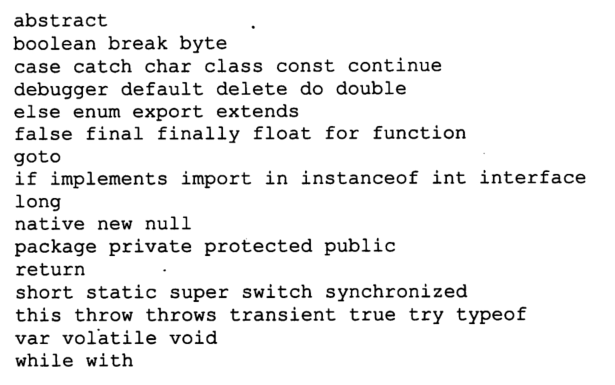
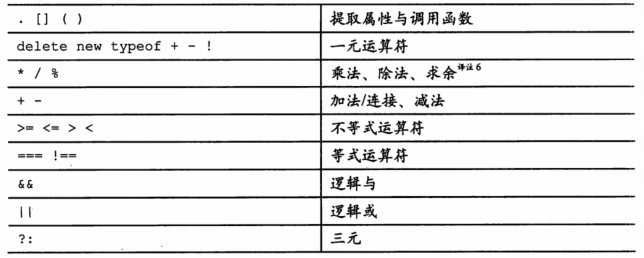

<center><h1>javascript</h1></center>

## 前言

### document.write和document.writeln区别

- document.write只执行第一个
- document.writeln可以执行多个

## 1. 语法

### 1.1空白（writespace）

空白可以表现为被格式化的字符或注释，空白通常没有什么意义，通常用它来分割字符序列，例如

```
var that = this
```

### 1.2 标识符

- 标识符有一个字母开头，气候可选择加一个或过个字母，数字，下划线，标识符不能使用下面保留字



- JavaScript不允许在对象字面量中，或者用点运算符提取对象属性时，使用保留字作为对象的**属性名**

- 标识符被用在语句，变量，参数，属性名，运算符和标记中

### 1.3 数字

- JavaScript只有一个数字类型，没有将整型和浮点型分开，所以1和1.0是相等的

- 如果一个字面量中有指数部分，那么这个字面量的值等于e之前的数字与10的e后面的数字的次方相乘，例如：2e2表示2*10²。
- 负数可以用"-"来表示
- NaN是一个数值，他不代表任何值，表示不能产生正常结果的运算结果，它的类型是Number
- Infinity是number类型
- Math方法后面学

### 1.4 字符串

- 被包在一对单引或双引中，
- \u可将数字编码转译成字符，例如： "\u0041" === "A"
- 字符串方法后面看

### 1.5 语句

- 一个编译单元包含一直可执行的语句，在web浏览器中，每个script标签提供一个编译且立即执行的编译单元。

- switch，while，for，do...while，for...in

- try... catch... ： 抛出异常

  ```
  var a = 1
  try{
      if(a<10) throw('太小')
      if(a==10) throw('正好')
      if(a>10) throw('太大')
  }catch(err){
  	console.log(err)
  }
  ```

### 1.6 表达式

- 最简单的表达式是字面量（字符串或数字），变量，内置的值（true，null，underfined，NaN等），以new开头的调用表达式，以delete揩油的属性提取表达式，包在圆括号中间的表达式等

- 运算符优先级：

  

- type会产生的值有：number，string，Boolean，underfined，function，object

- &&

  - 为真，取第二个值
  - 为假，如果第一个为假，取第一个值，否则取第二个值

- ||

  - 为真，如果第一个为真，取第一个值，否则取第二个值
  - 为假，取第二个值

### 1.7 字面量

对象字面量是一种可以方便的按照指定的规格创建新对象的表示法，属性名可以是标识符或字符串

### 1.8 函数

重复执行的代码块，在需要时可以直接调用

## 2. 对象

- JavaScript中的对象是可变的键控集合，数组，函数都是对象
- 对象是属性的容器，其中每个属性都有名字和值，属性的名字可以包括空字符串在内的任意字符串，属性值可以是underfined之外的任意值。
- JavaScript中的对象是无类型的，他对新属性的属性名和属性值没有显示，对象可以用来汇集和管理数据，对象可以包含对象。
- JavaScript包含一种原型链特征，允许对象继承另外一个对象的属性，减少对象初始化时消耗时间和内存。

### 2.1 对象字面量

对象字面量提供了非常方便的对象创建方式

- 创建一个空对象

  ```
  var obj = {};
  obj.name = 'bob';
  obj.age = 18
  ```

- 创建一个对象

  ```
  var obj = {
      name: 'bob',
  	age: 18
  };
  ```

- 创建一个嵌套对象

### 2.2 检索（索引）

- 属性值获取方法：对象["属性名"] 或 对象.属性名

- 获取一个不存在的属性会得到underfined

- 为避免的到underfined，可以用||来设置默认值

  - var name = obj["name"] || "Bob"

- 如果从underfined中获取成员属性会报错（TypeError），此时通过&&运算符可以避免报错

  ```
  var obj = {
          name: 'mary',
          age: 19
      }
  console.log(obj.sex);//undefined
  console.log(obj.sex.n);//Uncaught TypeError:Cannot read property 'name' of undefined
  console.log(obj.sex && obj.sex.n)//undefined
  ```

### 2.3 更新

- 对象中的值可以通过赋值来更新
- 如果对象没有这个属性值，则会给对象添加上这个属性

### 2.4 引用

- 对象通过引用来传递，他们永远不会被复制

  ```
  var obj = {
      name: 'aaa',
      age: 19
  }
  var obj1 = obj;
  obj1.sex = '男';
  console.log(obj.sex) //男
  ```

- 对象赋值是直接将地址赋值给变量，所以两个变量的地址是一样的，更改其中一个，领一个变量也会发生变化

  ```
  var obj = {
      name: 'aaa',
      age: 19
  }
  var obj2 = {
      name: 'aaa',
      age: 19,
      sex: '男'
  }
  var obj1 = obj;
  obj1.sex = '男';
  console.log(obj.sex) //男
  console.log(obj);//{name: "aaa", age: 19, sex: "男"}
  console.log(obj1);//{name: "aaa", age: 19, sex: "男"}
  console.log(obj2);//{name: "aaa", age: 19, sex: "男"}
  console.log(obj === obj1)//true
  console.log(obj === obj2)//false
  ```

### 2.5 原型

- 每个一个原型对象链接到一个原型对象，并且他可以从中继承属性，所有通过字面量创建的对象都会链接到Object.prototype，它是JavaScript中的标配对象
- <span style="color:red">当你创建一个对象时，你可以选择某个对象作为它的原型</span>
- 原型关系是一种动态的关系，如果添加一个新的属性在原型上，那这个属性可以直接拿来用

### 2.6 反射


### 2.7 枚举

- for循环

- for...in循环

- `Object.getOwnPropertyNames(obj)` 枚举得到对象的属性名，返回值是一个数组

  ```js
  var obj = {
      name: 'xjaioo',
      age: '18',
      bobby: ['1','2','3']
  }
  console.log(Object.getOwnPropertyNames(obj));//["name", "age", "bobby"]
  ```

  

  

### 2.8 删除（delete）

delete可以删除对象的属性

```js
var obj = {
    name: 'xjaioo',
    age: '18',
    bobby: ['1','2','3']
}
delete obj.bobby;
console.log(obj);//{name: "xjaioo", age: "18"}
```

### 2.9 减少全局变量污染

- JavaScript可以很随意的定义全局变量，但是全局变量可能会削弱程序的灵活性
- 解决方法：设置一个空对象作为全局变量，将需要的变量作为这个全局变量的属性添加进来

## 3.函数

函数包含一组语句，他们是JavaScript的基础模块单元，用于代码复用，信息隐藏和组合调用

函数用于指定对象的行为，一般来说，所谓编程就是将一组需求分解成一组函数与数据结构的技能

### 3.1 函数对象

- 函数是对象
- 函数被创建时会有一个prototype属性，这个属性下有一个constructor属性，这个属性就是该函数本身
- 函数可以储存变量，数组，可以作为参数传入

### 3.2 函数字面量

函数字面量包括四个部分：

- 保留字function
- 函数名，函数可以通过函数名来调用自己
- 参数（可不填）
- 函数主体：执行的语句

### 3.3 调用

- 调用一个函数会暂停当前函数的执行，传递控制权和参数给新函数。除了声明时定义的形式参数，每个函数还接收两个附加的参数:this和arguments。参数this在面向对象编程中非常重要，它的值取决于调用的模式。在JavaScript中一共有4种调用模式:方法调用模式、函数调用模式、构造器调用模式和apply调用模式。这些模式在如何初始化关键参数this上存在差异。

- 调用运算符是跟在任何产生一个函数值的表达式之后的一对圆括号。圆括号内可包含零个或多个用逗号隔开的表达式。每个表达式产生一个参数值。每个参数值被赋予函数声明时定义的形式参数名。当实际参数(arguments)的个数与形式参数（parameters)的个数不匹配时，不会导致运行时错误。如果实际参数值过多了，超出的参数值会被忽略。如果实际参数值过少，缺失的值会被替换为undefined。对参数值不会进行类型检查:任何类型的值都可以被传递给任何参数。

- 调用模式

  - 方法调用模式（函数作为一个对象的属性）

    - 当一个函数被保存为对象的一个属性时，我们称它为一个方法，**当方法被调用时，this被绑定到改对象**
    - 方法可以通过this来访问自己所属的对象，并访问对象中的属性和方法

    ```js
    var myobject = {
        value: 0,
        increment: function (inc){
        	this.value += typeof inc === 'number' ? inc : 1;
        )
    };
    myObject.increment() ;
    document.writeln (myobject.value);// 1
    myobject.increment (2) ;
    document.writeln (myobject.value);// 3
    ```

  - 函数调用模式

    当函数只是一个单纯的函数而不是属性时，this被绑定在全局变量中，指向的是window，如果想获取到对象，需要将对象方法中的this保存为一个变量，然后在函数中使用

    ```js
    myobject.double = function () {
    	var that = this;
        var helper = function () {
    		that.value = add (that.value, that.value)
        };
    	helper();
    }
    myobject.double () ;
    document.writeln (myObject.value);
    ```

  - 构造器调用模式（构造函数）

    ```js
    var Quo = function (string) {
    	this.status = string;
    };
    Quo.prototype.get_status = function () {
    	return this.status;
    };
    var myQuo = new Quo ( "confused" ) ;
    document.writeln (myQuo.get_status());//打印显示“confused”。
    ```

  - Apply调用模式

    apply的第一个参数是要绑定的this的值，第二个是一个由参数构成的数组

    ```js
    function sum(x,y){
        var add = 0;
        for(var i=0;i<arguments.length;i++){
            add+=Number(arguments[i])
        }
        return add
    }
    var arr = [1,2,3,5];
    console.log(sum.apply(null,arr))
    ```

### 3.4 参数

当函数被调用时，会得到一个“免费”配送的参数，那就是arguments 数组。函数可以通过此参数访问所有它被调用时传递给它的参数列表，包括那些没有被分配给函数声明时定义的形式参数的多余参数。这使得编写一个无须指定参数个数的函数成为可能:

### 3.5 返回

- return语句可用来提前结束函数执行

- 一个函数总是会有返回值的，如果没有指定则返回underfined

- 如果函数调用时在前面加上了new前缀，且返回值不是一个对象，则返回this (该新对象)。

### 3.6 异常抛出

- throw语句

  ```js
  function add(x,y){
      if(typeof x !== 'number' || typeof y !== 'number'){
          throw{
              name: 'TypeError',
              message: 'add needs numbers'
          }
      }else{
          return x+y
      }
  }
  console.log(add(1,'d'))
  ```

- try..throw...catch

  ```js
  function try_it(x,y) {
      try {
          if(typeof x !== 'number' || typeof y !== 'number'){
              throw{
                  name: 'TypeError',
                  message: 'add needs numbers'
              }
          }
      }catch(e){
          console.log (e.name + ': ' + e.message)
      }
  }
  try_it('w',3);
  ```

  

### 3.7 扩充类型的功能

- **创建一个method方法方便创建函数（没看懂是怎么回事）**

  ```js
  Function.prototype.method = function (name,func) {
      this.prototype [name] = func;
      return this;
  };
  ```

- 创建一个method方法，给Number添加一个intrger方法，可以处理整数

  ```js
  Function.prototype.method = function (name,func) {
      this.prototype [name] = func;
      return this;
  };
  Number.method('intrger',function(){
      return this > 0 ? Math['ceil'](this) : Math['floor'](this)
  })
  console.log((5.4).intrger());//6
  console.log((-5.4).intrger());//-6
  ```

- 创建一个method方法，给String添加一个trims方法，可以处理去除字符串的首位空字符

  ```js
  Function.prototype.method = function (name,func) {
      this.prototype [name] = func;
      return this;
  };
  String.method('trims',function(){
      return this.replace(/^\s+ | \s+$/g,'')
  })
  console.log('  hello  '.trims())
  ```

### <span style="color:red">3.8 递归</span>

递归就函数在自己内部调用自己

案例跳过有点看不懂

```js

```


### 3.9 作用域

- 在编程语言中，作用域控制着变量和参数的可见性及生命周期，这使得变量名称的冲突减少，并提供了自动内存管理
- javascript不支持块级作用域

### 3.10 闭包


### 3.11 回调


### 3.12 模块


### 3.13 级联


### 3.14 柯里化


### 3.15 记忆


## 4. 继承

### 4.1 伪类


### 4.2 对象说明符


### 4.3 原型


### 4.4 函数化


### 4.5 部件


## 5. 数组

### 5.1 数组字面量


### 5.2 长度

### 5.3 删除

### 5.4 枚举

### 5.5 容易混淆的地方

### 5.6 方法

### 5.7 指定初始值


## manifest缓存

```html
<html manifest="cache.manifest">

</html>
// 当前文件夹创建cache.manifest文件，在cache.manifest文件中配置
```


## 事件队列


```html
<!DOCTYPE html>
<html lang="en">
<head>
    <meta charset="UTF-8">
    <meta http-equiv="X-UA-Compatible" content="IE=edge">
    <meta name="viewport" content="width=device-width, initial-scale=1.0">
    <title>事件队列</title>
</head>
<body>
    <div class="box3"></div>
</body>
<script>
    let eventAll = {
        event: {},
        on: function(event, dataFn) {
            if(this.event[event]) {
                this.event[event].push(dataFn)
            } else {
                this.event[event] = []
                this.event[event].push(dataFn)
            }
        },
        emit: function(event, msg) {
            if(this.event[event]) {
                this.event[event].forEach(item => {
                    item(msg)
                })
            }
        }
    }
    eventAll.on('click', function(msg) {
        console.log(msg)
        console.log('触发1')
    })
    eventAll.on('click', function(msg) {
        console.log(msg)
        console.log('触发2')
    })
    // eventAll.emit('click', 'hello')
    
    eventAll.on('event', data => {
        console.log(data)
    })

    document.querySelector('.box3').onclick = function() {
        eventAll.emit('event', 'world')
    }
    
</script>
</html>
```


## 修改this指正：call，apply，bind

```js
var a = {
    user:"追梦子",
    fn:function(a, b){
        console.log(this, a, b);
    }
}
a.fn() // {user: '追梦子', fn: ƒ}   1   2

// 给把fn赋值给b，此时就this指向就会改变
var b = a.fn
b() // Window   1   2

```

### 1. bind修正（赋值时修正）

```js
var b = a.fn.bind(a)
a.fn() // {user: '追梦子', fn: ƒ}   1   2
```

### 2. call修正（调用时修正）

```js
var b = a.fn
b.call(a, 1, 2) // {user: '追梦子', fn: ƒ}   1   2
```

### 3. apply修正（调用时修正）

```js
var b = a.fn
b.apply(a, [1, 2]) // {user: '追梦子', fn: ƒ}   1   2
```


## 埋点

### 1. 定义

js埋点指的是在应用服务器中的每一个页面中都嵌入一段js脚本，使用户在访问页面时 自动触发js，收集用户访问行为日志，并提交到日志服务器。

### 2. 统计指标

 进行js埋点的目的是为了获取并统计网站时刻的访问信息，主要的需要的指标如下（当然不限于下面的指标）：

（1）pv（点击量）

（2）uv（独立访客数）

js经典埋点：

```html
<script>
    const img = new Image()
    img.src = '/api/hello?world=123'
</script>
```

