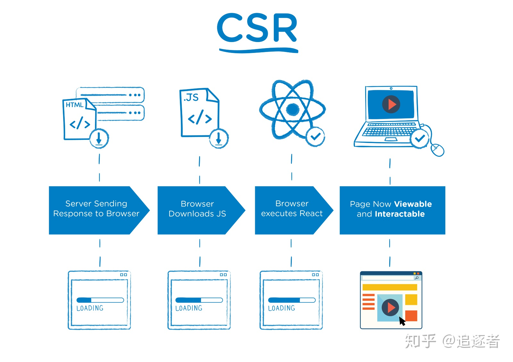
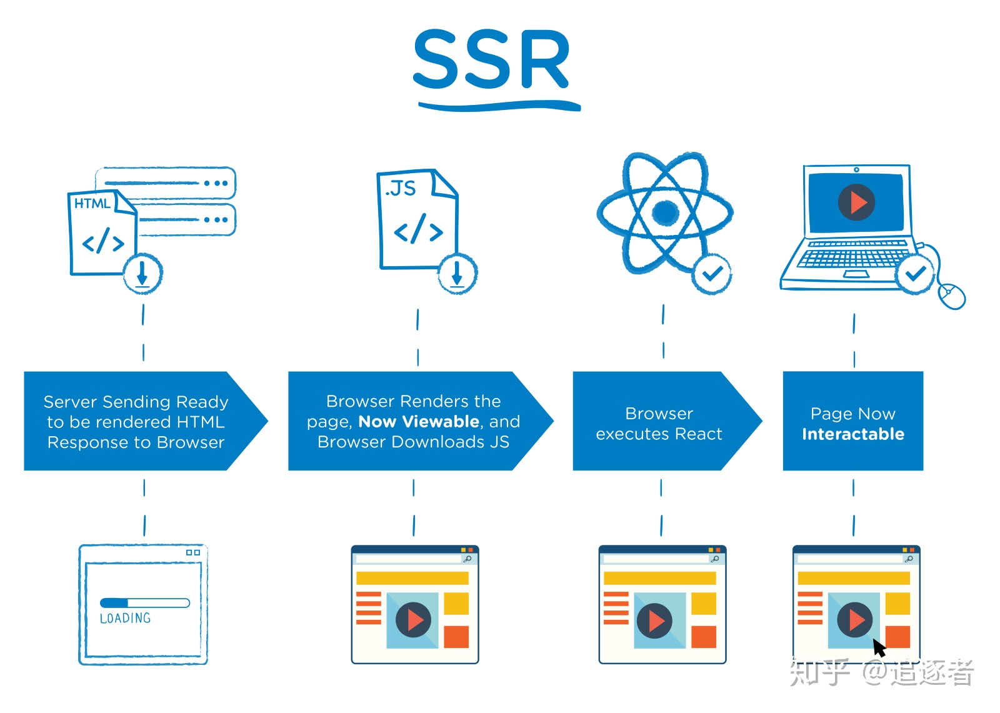

<center><h1>Vue SSR服务端渲染</h1></center>

## 1. CSR（Client Side Render）

CSR是Client Side Render简称，页面上的内容是我们加载的js文件渲染出来的，js文件运行在浏览器上面，服务端只返回一个html模板。



## 2. SPA（single page web application）

single page application单页面应用，只有一张Web页面的应用
加载单个html页面并在用户与应用程序交互时动态更新该页面的Web应用程序
页面初始化时加载必须的htm,js,css，所有操作都在此页面完成，通过js控制
MVVM：经典的MVVM开发模式，前后端各负其责
ajax：重前端，业务逻辑在本地操作，数据通过ajax同步提交

**优点**：只需要处理#后面的字符，页面并不会重载，实现局部刷新

**缺点**：不容易管理，也不够安全，不利于SEO，SEO需花费额外的功夫

## 3. SSR（Server Side Render）

SSR是Server Side Render简称；页面上的内容是通过服务端渲染生成的，浏览器直接显示服务端返回的html就可以了。



## 4. nuxt.js

中文网：https://www.nuxtjs.cn/

### 4.1 创建 [create-nuxt-app](https://github.com/nuxt/create-nuxt-app)脚手架工具

```shell
$ npx create-nuxt-app <项目名>
```

### 4.2 运行

```shell
npm run dev
```

### 4.3 资源目录

- assets：用于组织未编译的静态资源如 `LESS`、`SASS` 或 `JavaScript`。
- components：用于组织应用的 Vue.js 组件。Nuxt.js 不会扩展增强该目录下 Vue.js 组件，即这些组件不会像页面组件那样有 `asyncData` 方法的特性。
- layouts：用于组织应用的布局组件。
- middleware：目录用于存放应用的中间件。
- pages：用于组织应用的路由及视图。Nuxt.js 框架读取该目录下所有的 `.vue` 文件并自动生成对应的路由配置。
- plugins：用于组织那些需要在 `根vue.js应用` 实例化之前需要运行的 Javascript 插件。
- static：用于存放应用的静态文件，此类文件不会被 Nuxt.js 调用 Webpack 进行构建编译处理。服务器启动的时候，该目录下的文件会映射至应用的根路径 `/` 下。

### 4.4 路由配置

#### 4.4.1 路由生成

##### 4.4.1.1 路由创建

在pages目录下创建vue文件

##### 4.4.1.2 路由导航

```html
<router-link to="/">hello admin</router-link>
<nuxt-link to="/">hello admin</nuxt-link>
<NuxtLink to="/">hello admin</NuxtLink>
<n-link to="/">hello admin</n-link>
<NLink to="/">hello admin</NLink>
```

路由懒加载

```html
<NuxtLink to="/" no-prefetch>hello admin</NuxtLink>
```

##### 4.4.1.3 动态路由

```html
<li v-for="good in goods" :key="good.id">
    <nuxt-link :to="`/detail/${good.id}`">{{ good.name }}</nuxt-link>
</li>
```

注：需要建一个`detail`文件夹，文件夹下用 `_id.vue` 来命名，此时路由配置的name为`detail-id`

```js
{
    path: "/detail/:id?",
    component: _7822c9f2,
    name: "detail-id"
}
```

多个参数可以再嵌套一层

##### 4.4.1.4 嵌套路由

父路由命名和子路由文件夹命名一样

```html
<template>
    <div>
        父路由
        <!-- 占位符 -->
        <nuxt-child></nuxt-child>
    </div>
</template>
```

##### 4.4.1.5 错误页面

`_.vue`

#### 4.4.2 路由配置

https://www.nuxtjs.cn/api/configuration-router


### 4.5 页面布局

#### 4.5.1 页面标题修改

```js
export default {
    head: {
        title: 'hello wprld',
        meta: [
            { charset: 'utf-8' },
            { name: 'viewport', content: 'width=device-width, initial-scale=1' }
        ],
        link: [
            { rel: 'stylesheet', href: 'https://fonts.googleapis.com/css?family=Roboto' }
        ]
    }
}
```

#### 4.5.2 自定义布局

`layouts` 目录中的每个文件 (*顶级*) 都将创建一个可通过页面组件中的 `layout` 属性访问的自定义布局。

假设我们要创建一个 *博客布局* 并将其保存到`layouts/blog.vue`:

```vue
<template>
  <div>
    <div>我的博客导航栏在这里</div>
    <nuxt />
  </div>
</template>
```

然后我们必须告诉页面 (即`pages/posts.vue`) 使用您的自定义布局：

```vue
<template>
  <!-- Your template -->
</template>
<script>
  export default {
    layout: 'blog'
    // page component definitions
  }
</script>
```

#### 4.5.3 错误页面

这个布局文件不需要包含 `<nuxt/>` 标签。你可以把这个布局文件当成是显示应用错误（404，500 等）的组件。

```vue
<template>
  <div class="container">
    <h1 v-if="error.statusCode === 404">页面不存在</h1>
    <h1 v-else>应用发生错误异常</h1>
    <nuxt-link to="/">首 页</nuxt-link>
  </div>
</template>

<script>
  export default {
    props: ['error'],
    layout: 'blog' // 你可以为错误页面指定自定义的布局
  }
</script>
```

#### 4.5.4 数据的获取

##### 4.5.4.1 asyncData 方法

`asyncData`方法会在组件（**限于页面组件**）每次加载之前被调用。它可以在服务端或路由更新之前被调用。在这个方法被调用的时候，第一个参数被设定为当前页面的[上下文对象](https://www.nuxtjs.cn/api#上下文对象)，你可以利用 `asyncData`方法来获取数据，Nuxt.js 会将 `asyncData` 返回的数据融合组件 `data` 方法返回的数据一并返回给当前组件。

**注意**：由于`asyncData`方法是在组件 **初始化** 前被调用的，所以在方法内是没有办法通过 `this` 来引用组件的实例对象。

Nuxt.js 返回一个promise对象，可以使用 [async 或 await](https://github.com/lukehoban/ecmascript-asyncawait) 

asyncData 参数：

- 上下文对象
  - req：请求参数
  - res：响应参数
  - $axios：axios对象
  - query：查询参数
  - params：动态路由参数
  - route：路由信息
  - error：错误信息
  - redirect：重定向
- 回调函数

##### 4.5.4.2 


### 4.6 中间件


目录：在middleware目录先新建一个

```js
// auth.js
// 这里第一个参数是上下文，
export default function({ route, redirect, store }) {
    if(!store.state.user.token) {
        redirect('/login?redirect=' + route.path)
    }
}
```

应用

```js
// 局部注册
export default {
    name: 'admin',
    middleware: ['auth']
}

// 全局注册
// nuxt.config.js
module.exports = {
    router: {
        middleware: 'auth'
    }
}
```

### 4.7 vuex

#### 4.7.1 基本

登录页面

```js
methods: {
    async handleLogin() {
        const res = await this.$store.dispatch('user/verifyLogin', this.user)
        if(res) {
            this.$router.push(this.$route.query.redirect || '/')
        }
    }
}
```

user.js

```js
// 具名导出常见模块中的项

export const state = () => ({
    token: ''
})
export const mutations = {
    SET_TOKEN(state, payload) {
        console.log(state)
        state.token = payload
    }
}
export const actions = {
    async verifyLogin({ commit }, payload) {
        const { ok, token } = await this.$axios.$post('/api/login', payload)
        if(ok == 1) {
            commit('SET_TOKEN', token)
            return token
        } else {
            return false
        }
    }
}
```

node后台路由

```js
router.post('/login', ctx => {
    const user = ctx.request.body
    if(user.username === 'jerry' && user.password === '123456') {
        const token = 'a mock token'
        ctx.cookies.set('token', token)
        ctx.body = {
            ok: 1,
            token
        }
    } else {
        ctx.body = {
            ok: 0
        }
    }
})
```

#### 4.7.2 持久化token

##### 4.7.2.1 拦截

store文件夹下建index.js文件

需要安装一个模块

```shell
npm i cookie-universal-nuxt -S
```

注册模块：`nuxt.config.js`

```js
modules: [
    '@nuxtjs/axios',
    'cookie-universal-nuxt'   // cookie-universal-nuxt模块
  ],
```

/store/index.js

```js
export const actions = {
    // 改action只能出现在index中，且只能在服务端执行一次
    // 参数1：store，参数2：nuxt的上下文
    nuxtServerInit({ commit }, { app }) {
        // 这里用app.$cookies直接能拿到cookie的内容
        const token = app.$cookies.get('token')
        if(token) {
            commit('user/SET_TOKEN', token)
        }
    }
}
```

##### 4.7.2.2 携带请求头

plugins/interceptor.js

```js
export default function({ $axios, store }) {
    // onRequest是模块提供的帮助方法
    $axios.onRequest(config => {
        if(store.state.user.token) {
            config.headers.Authorization = 'Bearer ' + store.state.user.token
        }
    })
}
```

注册插件：`nuxt.config.js`

```js
plugins: [
    '@/plugins/element-ui',
    '@/plugins/interceptor'  // 请求拦截插件
  ],
```

## 4. nuxt.js原理

### 4.1 依赖包

- express：node框架
- vue-router：前端路由
- vue-server-renderer：服务端渲染器

