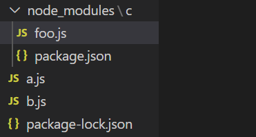
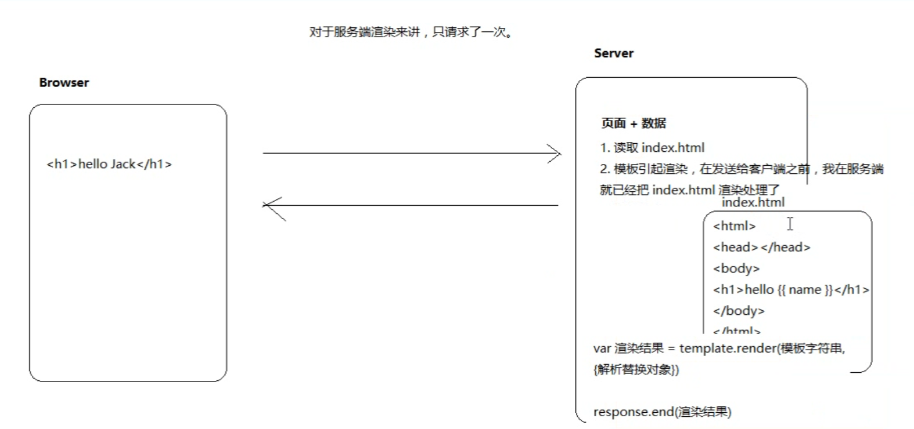
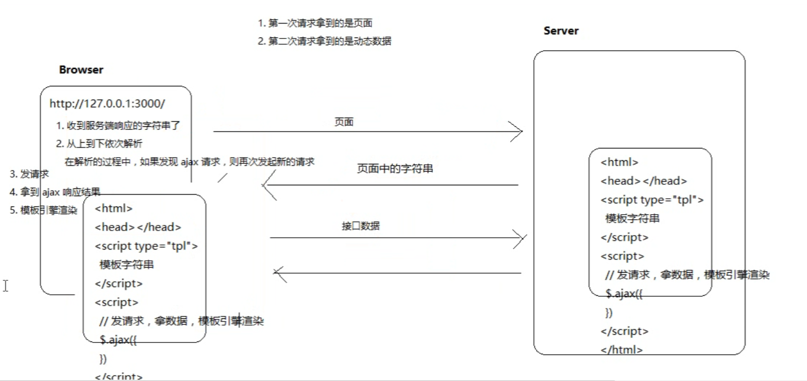
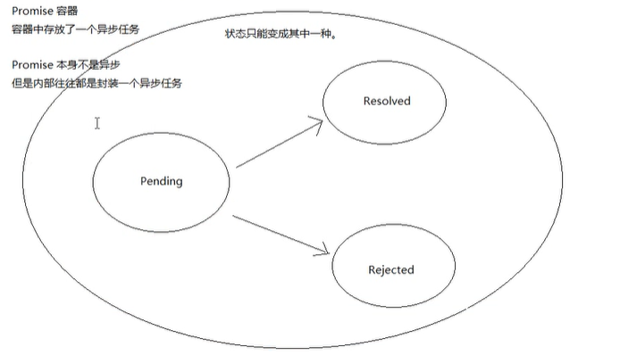

<center><h1>nodejs</h1></center>

## 一、是什么

### 基本概念

- node是一个JavaScript运行在Chrome v8引擎上的运行环境
  - JavaScript引擎：专门执行JavaScript代码的虚拟机
- JavaScript可以完全脱离浏览器运行归功于nodejs
- node中的JavaScript只包括EcmaScript，没有DOM和BOM
- nodejs中提供了服务器级别的API操作
  - 文件读写
  - 网络服务的构建
  - 网络通信
  - http服务器

- 优点
  - 时间驱动
  - 非阻塞IO模型（异步）
  - 轻量和高效

## 二、安装

- 官网安装

## 三、node中模块系统

### 1. require

require是一个方法，它可以用来加载文件模块并执行里面的代码，可以拿到文件模块导出的借口对象，后缀名可省略

a.js

```javascript
console.log('我是a，start')
require('./b')
console.log('我是a，end')
```

b.js

```js
console.log('我是b')
```

运行结果： 我是a，start    =>  我是b  => 我是a，end

### 2. 模块作用域

​	各模块中的变量不会产生冲突，不能互相访问

- require加载规则

  - 优先从缓存加载，当需要加载模块时先从缓存中去找，如果缓存中有，直接拿来用，如果没有，则加载

  - 判断模块标识：require后面的内容叫做模块标识符

    - 核心模块

      直接引用即可

    - 第三方模块

      - 直接引用
      - 读取第三放模块的步骤
        - 先找到当前目录的node_modules
        - 在**node_modules**目录下找到要引入的模块
        - 在模块目录下找到**package.json**文件，找到**main**属性，属性值就是要加载的文件
        - 如果package.json文件不存在或main属性不存在是，会自动找**index.js**
        - 如果当前目录没有node_modules，则在上级目录找，直到磁盘根目录，如果还没有，会报错 `can not find module xxx`
        - 一个项目只有一个node_modules，不会出现多个，一般放在项目根目录中

      a.js执行文件

      ```js
      const c = require('c')
      console.log(c)
      ```

      package.json

      ```js
      {
          "main": "foo.js"
      }
      ```

      foo.js

      ```js
      console.log('c模块下的foo被加载了')
      module.exports = '我是c模块下的foo';
      ```

      文件结构

      

      输出效果

      ```js
      //c模块下的foo被加载了
      //我是c模块下的foo
      ```

- 自己写的模块
      - 需要些路径

### 3. 模块的导入和导出

exports默认是一个空对象，用来储存导出的变量或函数

#### 3.1 require和exports配合使用

- 模块导入赋值（将b导出的模块全部引入，在进行选择使用）

  a.js

  ```javascript
  const bs = require('./b')
  console.log(bs.b)
  bs.sum(1,2)
  ```

  b.js

  ```javascript
  const b = 'hello';
  exports.b = b;
  exports.sum = function(x,y){
      console.log(x*y)
  }
  ```

- 模块解构赋值（导入需要的模块）

  a.js

  ```javascript
  const {b} = require('./b')  //解构赋值，只导出需要的部分
  const {sum} = require('./b') //解构赋值
  console.log(b)
  sum(1,2)
  ```

  b.js

  ```javascript
  const b = 'hello';
  exports.b = b;
  exports.sum = function(x,y){
      console.log(x*y)
  }
  ```

#### 3.2 module.exports和exports的区别

在node中，每个模块内部都有一个自己的module对象，该module对象中有一个成员叫exports，默认是空对象，需要导出模块是 `module.exports = xxxxx` ,由于点操作写起来麻烦，所以node内置了exports变量，使`exports = module.exports`。

- require引入的其实是module.exports对象
- 如果指针不变，则exports和module.exports是一样的
- 不管哪个指针改变，导出的都是module.exports对象而不是exports
- 模块最后return出去的是module.exports，当exports或module.exports被重新赋值是，exports将不起作用

### 4. node编写模块

- Ecmascript语言
  - 与浏览器不同，在node中没有DOM和BOM
- 内置核心模块
  - http服务的http模块
  - 文件操作的fs模块
  - url路径的url模块
  - path路径的path模块
  - 操作系统信息os模块
- 第三方模块
  - 模板引擎art-template
  - 
- 自己写的模块

### 5. CommentJS模块规范

#### 5.1 什么是模块化

- 文件作用域（模块作用域）
- 通信规则
  - 加载，引入（require）
  - 导出，暴露（exports）

#### 5.2 CommentJS模块规范

node中的JavaScript有一个非常重要的概念：模块系统

- 模块作用域
- 使用require来加载模块
- 使用exports接口对象来导出模块中的成员

## 四、http模块

### 1. 创建服务器

- 形式1

  ```javascript
  //引入核心模块
  const http = require('http');
  http.createServer(function(req,res){
    	res.writeHead(200,{'content-Type': 'text/plain;charset=utf-8'});
   	res.write('111')
    	res.end()
  }).listen(8000)
  ```

- 形式2

  ```javascript
  //引入核心模块
  const http = require('http');
  var server = http.createServer();
  server.on('request',(req,res)=>{
  	res.writeHead(200,{'content-Type': 'text/html;charset=utf-8'});
  	res.write('111')
  	res.end()
  })
  server.listen(8000)
  ```

  - request
    - url： 请求的路径
    - ......
  - response
    - write：给客户端发送响应数据，可以有多个
    - end：响应结束说明
    - writeHead：响应头
    - ......

### 2. Content-Type

- text/plain识别普通文本

- text/html可以识别代码片段

  https://www.oschina.net/

### 3. 编码问题

​	服务器默认发送的数据是utf-8编码的，但是浏览器不知道你用的是utf-8的内容，此时浏览器会按照当前操作系统的默认编码去解析中文操作系统，默认的是gbk

- charset=utf-8

### 4. 运行nodejs

- node js文件名

### 5.web服务器

- ip和端口号

  - ip地址用来定位计算机
  - 端口号用来定位具体的应用程序
  - 需要联网的应用程序会占用端口号
  - 端口号的范围是0-65536
  - 在计算机中一些默认的端口尽量不要去使用
    - http服务的80端口
  - 在一台计算机中通一个端口号只能被一个应用程序占用

- 获取计算机ip地址

  cmd输入ipconfig，就能看到计算机的ip地址了，在计算机上开一个服务器，别人就能在通过计算机的ip地址和端口号来访问你的服务器了。

## 五、fs模块

### 1. 文件夹

#### 1.1 新建文件夹

- 同步方法

  ```
  fs.mkdirSync(path[, options])
  	第一个参数是地址，就是你创建的文件夹存放的地址
  	第二个参数不是必填的参数, options 参数可以是一个整数，用于指定文件的模式（权限与粘滞位）。 也可以是一个对象，其中 recursive 属性指定是否创建父目录。
  ```

  ```javascript
  //引入核心模块
  const fs = require('fs');
  try{
  	let result = fs.mkdirSync('./newFolder');
  }catch(e){
  	console.log(new Error('错误'))
  }
  ```

- 异步方法

  ```javascript
  fs.mkdir(path[,options],callback);
  	第一个参数是地址，就是你创建的文件夹存放的地址
  	第二个参数不是必填的参数, options 参数可以是一个整数，用于指定文件的模式（权限与粘滞位）。 也可以是一个对象，其中 recursive 属性指定是否创建父目录。
  	第三个参数是回调函数，参数就是err错误
  ```

  ```javascript
  fs.mkdir('./newFolder',{recursive: true},err=>{
  	if(err) throw err
  })
  ```

#### 1.2 删除文件夹

- 同步方法

  ```javascript
  fs.rmdirSync(path);
  ```

  ```javascript
  fs.rmdirSync('./newFolder')
  ```

- 异步方法

  ```javascript
  fs.rmdir(path,callback)
  ```

  ```javascript
  fs.rmdir('./newFolder',err=>{
  	if(err) throw err
  })
  ```

#### 1.3 读取文件夹目录

- 同步方法

  ```javascript
  console.log(fs.readdirSync('./newFolder'))
  ```

- 异步方法

  ```javascript
  fs.readdir(path[,options],callback)
  ```

  ```javascript
  fs.readdir('./newFolder', (err,file)=>{
  	console.log(err);
  	console.log(file)
  })
  ```

### 2. 文件

#### 2.1 写入（新建，覆盖）文件

```javascript
fs.writeFile('./newFolder/text.txt','HTML', err=>{
	if(err) throw err
})
```

#### 2.2 写入（追加）文件

```javascript
fs.appendFile('./newFolder/text.txt',',css,js',err=>{
	if(err) throw err
})
```

#### 2.3 删除文件

```javascript
fs.unlink('./data.txt',err=>{
	if(err) throw err
})
```

#### 2.4 读取文件

```javascript
fs.readFile('./newFolder/text.txt','utf-8',(err,data)=>{
    if(err) throw err
    console.log(data)
})
```

由于文件中储存的都是二进制数据，读取到的数据要进行处理：

- data.toString()进行转化

- 在读取时添加编码utf-8

### 3. 判断是文件夹还是文件

```javascript
fs.stat(path[, options], callback);
```

```javascript
fs.stat('./data.txt',(err,state)=>{
    if(err) throw err
    console.log(state.isFile()); 
    console.log(state.isDirectory())
})
```

- isFile：判断是不是文件
- isDirectory：判断是不是文件夹

## 六、模板引擎（art-template）

### 1. 安装art-template

- npm install art-template
- https://unpkg.com/art-template@4.13.2/lib/template-web.js

### 2. 模板字符串的使用

#### 2.1 在HTML文件中使用

- 基本结构

  ```javascript
  <!DOCTYPE html>
  <html lang="en">
  <head>
      <meta charset="UTF-8">
      <title>Document</title>
  </head>
  <body>
      <h1></h1>
  </body>
  //加载art-template文件
  <script src="./node_modules/art-template/lib/template-web.js"></script>
  <script type="text/template" id="tp1">
      {{name}}
  </script>
  <script>
      const ret = template('tp1',{
          name: 'Jack'
      })
      document.getElementsByTagName('h1')[0].innerHTML = ret;
  </script>
  </html>
  ```

  script标签之间的内容浏览器只识别{{}}，其他的都按字符串处理

- 循环

  ```html
  <script type="text/template" id="tp1">
      {{name}} <br/>
      {{each hobby}} {{$value}} {{/each}}
  </script>
  <script>
      const ret = template('tp1',{
          name: 'Jack',
          hobby: [
              'backetball',
              'baseball',
              'eat',
              'sleep'
          ]
      })
      document.getElementsByTagName('h1')[0].innerHTML = ret;
  </script>
  ```

#### 2.2 在javascript文件中是使用

- 基本结构

  ```javascript
  //加载art-template
  const template = require('art-template');
  const ret = template.render('hello {{name}}',{
      name: 'nodejs'
  })
  console.log(ret)
  ```


​	

## 七、服务器

### 1.开启服务器

​	创建www根目录	

```javascript
const http = require('http');
const fs = require('fs');
server.on('request',(req,res)=>{
    res.writeHead(200, {'Content-Type': 'text/html; charset=utf-8'})
    var url = req.url;
    var filePath = '/index.html';
    var basePath = 'C:/Users/admit/Desktop/node/node模块/www';
    if(url !== '/'){
        filePath = url
    }
    fs.readFile(basePath+filePath,(err,data)=>{
        if(err){
            res.end('404')
            return
        }else{
            res.end(data.toString())
        }
    })
})
```


### 2.apache目录

#### 2.1 字符串拼接

```javascript
const http = require('http');
const fs = require('fs');
//设置根路径
var basePath = 'C:/Users/admit/Desktop/node/node模块/www';
const server = http.createServer();
server.on('request',(req,res)=>{
    res.writeHead(200, {'Content-Type': 'text/html; charset=utf-8'})
    var rep = '';
    fs.readdir(basePath,(err,data)=>{
        data.forEach(item=>{
            if(fs.lstatSync(basePath+'/'+item).isFile()){
                rep += `<tr><td><a class="icon file" href="javascript:void(0)">${item}/</a></td><td class="detailsColumn" data-value="0"></td><td class="detailsColumn" data-value="1606198095">2020/11/25 下午4:31:24</td></tr>`
            }else{
                rep += `<tr><td><a class="icon dir" href="javascript:void(0)">${item}</a></td><td class="detailsColumn" data-value="0"></td><td class="detailsColumn" data-value="1606198095">2020/11/25 下午4:31:24</td></tr>`
            }
        })
    })
    fs.readFile('./index.html',(err,data)=>{
        if(err){
            res.end('文件错误')
            return
        }
        //替换index.html中标记的位置
        res.end(data.toString().replace('reps',rep))
    })
})
server.listen(8000)
```

#### 2.2 模板引擎

index.html

```html
<tbody id="tbody">
    {{each file}} 
    <tr><td><a class="icon file" href="javascript:void(0)">{{$value}}/</a></td><td class="detailsColumn" data-value="0"></td><td class="detailsColumn" data-value="1606198095">2020/11/25 下午4:31:24</td></tr>
    {{/each}}
    {{each directory}} 
    <tr><td><a class="icon dir" href="javascript:void(0)">{{$value}}/</a></td><td class="detailsColumn" data-value="0"></td><td class="detailsColumn" data-value="1606198095">2020/11/25 下午4:31:24</td></tr>
    {{/each}}
  </tbody>
```

服务器

```javascript
const fs = require('fs');
const http = require('http');
//引入模板引擎
const template = require('art-template');
var basePath = 'C:/Users/admit/Desktop/node/node模块/www/';
const server = http.createServer()
server.on('request',(req,res)=>{
    res.writeHead(200,{'Content-Type': 'text/html; charset=utf-8'})
    fs.readFile('./index.html',(err,data)=>{
        if(err) throw err;
        fs.readdir(basePath,(err,files)=>{
            var file = [];
            var directory = [];
            //判断是文件还是文件夹
            files.forEach(item=>{
                if(fs.lstatSync(basePath+item).isFile()){
                    file.push(item)
                }else{
                    directory.push(item)
                }
            })
            //服务端渲染
            res.end(template.render(data.toString(), {
                file: file,
                directory:directory,
                title: '目录',
                dir: 'www/'
            }))
        })
    })
})
server.listen(8000)
```


## 八、服务端渲染和客户端渲染

### 1. 服务端渲染

#### 1.1 服务端渲染过程

- 服务端渲染说白了就是服务端使用模板引擎进行渲染

- 模板引擎最早诞生于服务端，后来发展到前端

- 客户端渲染

  - 服务index.html问卷
  - 通过模板引擎渲染，在发送给客户端之前就已经把index.html渲染处理了，只等待浏览器进行解析

  

#### 1.2 服务端处理静态资源

在浏览器渲染的过程中，link，src，video，audio，iframe，script等带有href和src属性的标签（具有外链资源）会自动发送请求。

注意：在服务端中，文件的路径一般不写相对路径，这个时候文件资源的路径是通过url路径来获取的，在服务器中可以开放一个用户可以访问的/public/ 目录，静态资源的路径要写成：/public/xxx 的形式，开放方法如下：

```javascript
if(request.url.indexOf('/public/') === '0'){
	fs.readFile('.'+request.url,(err,data)=>{
		if(err) throw err
		response.end(data)
	})
}
```

#### 1.3 服务端重定向

在Web应用中，有时会遇到页面需要Url重定向的情况。Url重定向分为301、302两种。301、302都是HTTP状态的编码，都代表着某个Url发生了转移。不同的是：

- 301重定向是永久的重定向（Moved Permanently），表示本网页永久性转移到另一个地址，搜索引擎在抓取新内容的同时也将旧的网址替换为重定向之后的网址。

  ```javascript
  var server = http.createServer(function (req, res) {
      res.writeHead(301, {'Location': 'http://itbilu.com/'});
      res.end();
  });
  server.listen(8000)
  ```

- 302重定向是临时的重定向（Moved Temporarily），表示本网页暂时性转移到另一个地址，搜索引擎会抓取新的内容而保留旧的网址。

  ```javascript
  var server = http.createServer(function (req, res) {
      res.statusCode = 302;
      res.setHeader('Location', '/');
      res.end()
  server.listen(8000)
  ```

#### 1.4 服务端渲染案例（发表评论）

​	app.js

```javascript
const http = require('http');
const fs = require('fs');
const url = require('url');
var template = require('art-template')
var arr = [
    {
        name: '张三',
        message: 'hello world',
        date: new Date().toDateString() + ' ' + new Date().toTimeString()
    }
]
http.createServer(function(req,res){
    var urls = url.parse(req.url,true).pathname;
    var basePath = 'C:/Users/admit/Desktop/node/node模块/www1';
    var item = url.parse(req.url,true).query;
    var urlPath = '';
    if(urls === '/'){
        fs.readFile(basePath+'/index.html',(err,data)=>{
            if(err){
                res.end('读取路径失败')
            }else{
            //模板引擎替换
                res.end(template.render(data.toString(),{
                    arr
                }))
            }
        })
    }else if(urls === '/pinglun'){
        if(item.name){
        //给得到的数据添加时间
            item.date = new Date().toDateString() + ' ' + new Date().toTimeString();
            arr.unshift(item)
        }
        //重定向，将query等参数去掉
        res.statusCode = 302;
        res.setHeader('Location', '/');
        res.end()
    }else if(urls === '/comment'){
        fs.readFile(basePath+'/comment.html',(err,data)=>{
            if(err){
                res.end('读取路径失败')
            }else{
                res.end(data)
            }
        })
    }
}).listen(8000)
```

comment.html   （默认为get请求）

```html
<h1><span style="cursor: pointer;color:skyblue" onclick="location.assign('/')">首页</span>发表留言</h1>
<hr>
<form action="/pinglun">
    你的大名
     <br>
     <input type="text" name="name" id="">
     <br>
     留言内容
     <br>
     <textarea name="message" id="" cols="30" rows="10"></textarea>
     <br>
     <input type="submit" value="提交">
</form>
```

index.html

```html
<div id="app">
    <h1>Esample page header</h1>
    <button onclick="location.assign('/comment')">发表留言</button>
    <hr>
    <div class="content">
        <ul>
        //循环遍历评论对象
            {{each arr}}
            <li>
            <div class="left">{{$value.name}}说{{$value.message}}</div>
            <div class="right">{{$value.date}}</div>
            </li>
            {{/each}}
        </ul>
    </div>
</div>
```

### 2. 客户端渲染

- 浏览器请求ip地址
- 请求服务器响应的字符串 => 收到服务器响应的字符串
- 从上到下解析浏览器接收的字符串
- 解析过程中如果遇到ajax请求，需要再次发起新的请求，拿到ajax的响应数据，再次渲染




### 3. 区别

- 服务端渲染只发送一次请求，响应出来的就是结果，客户端不需要再做任何处理，所以渲染速度更快，但是服务端的压力会更大
- 客户端渲染不利于SEO搜索引擎优化
- 服务端渲染是可以被爬虫抓取到的，客户端异步渲染很难被爬虫抓取到
- 真正的网站是两者都有：如京东商品列表采用服务端渲染，为了SEO所搜引擎优化，评论用客户端渲染

## 九、npm（node package manager）

### 1. package.json（包描述文件）

- 建议每个项目都要有一个package.json文件
- 这个文件可以通过npm init初始化出来
  - dependencies：可以帮助我们保存第三方包的依赖信息
- 建议安装包的时候都加上--save，将依赖包的信息添加到package.json中

### 2. package-lock.json

- npm 5 之前是没有 `package-lock.json` 这个文件的，npm 5 以后才加入这个文件的
- 当你安装包时npm会自动创建或更新 `package-lock.json` 这个文件
- 保存了`node_modules`中所有依赖包的信息

### 3. 常用npm命令

- npm init

  - npm init -y ：可以跳过向导，快速生成

- npm install 安装包

  - npm install(i) ：安装package.json中的依赖项
  - npm install(i)  包名：只下载包
  - npm install(i)  包名 --save(-S)：下载包，并将包信息添加到package.json中

- npm uninstall(un)

  - npm uninstall(un) 包名：只删除包，不去除package.json中的信息
  - npm uninstall(un) 包名 --save(-S)：删除包，并去除package.json中的信息

- npm --help ：查看帮助

  npm 命令 --help：查看具体命令的使用帮助

### 4. 解决npm被墙问题

由于npm存储包的文件在国外，有时候会被墙，下载速度慢，这时候需要用到cnpm淘宝镜像，https://developer.aliyun.com/mirror/NPM?from=tnpm，使用方法：

- 安装cnpm

  ```shell
  npm install --global(-g) cnpm
  ```

- 在配置文件中添加淘宝镜像

  ```shell
  npm config set registry https://registry.npm.taobao.org
  ```

  查看是否配置成功

  ```shell
  npm config list
  ```

- 在每次安装包的时候都添加一个registry参数

  ```shell
  npm i jquery --registry=https://registry.npm.taobao.org
  ```

- 安装nrm

  ```shell
  npm i nrm -g
  ```

  查看镜像列表

  ```shell
  nrm list
  ```

  切换镜像源

  ```shell
  nrm use 镜像源
  ```

  

## 十、 express框架

### 1. 起步

#### 1.1 安装express

```shell
npm i express -S
```

#### 1.2 基本结构

```js
//引入express包
const express = require('express')
//创建app
const app = express()
//路由
app.get('/',(req,res)=>{
    res.send('hello world')
})
app.get('/home',(req,res)=>{
    res.send('at home 页')
})
// 监听的端口号
app.listen(8000,()=>{
    console.log('project is running at port 8000...')
})
```

#### 1.3 基本路由

##### 1.3.1 get

get请求表单get提交方法时，获取请求参数的方法

```js
req.query
```

##### 1.3.2 post

// **body-parser已弃用**

post请求表单post提交方法时，获取请求参数的方法：

express中没有内置获取post表单请求参数的api，需要借助第三方插件：`body-parser`

- 安装

  ```shell
  npm i body-parser -S
  ```

- 配置

  ```js
  const bodyParser = require('body-parser')
  app.use(bodyParser.urlencoded({ extended: false }))
  ```

- 获取

  ```js
  req.body
  ```

其他方法

express自带的方法

```js
app.use(express.urlencoded())
```

##### 1.3.3 路由模块

app.js

```js
var express = require('express');
var app = express();
var indexRouter = require('./routes/index');
var usersRouter = require('./routes/users');

app.use('/', indexRouter);
app.use('/users', usersRouter);
```

index.js

```js
var express = require('express');
var router = express.Router();

/* GET home page. */
router.get('/home', function(req, res, next) {
  res.render('index', { title: 'Express' });
});

module.exports = router;
```

**访问：http://localhost:3000/home**

users.js

```js
var express = require('express');
var router = express.Router();

/* GET users listing. */
router.get('/name', function(req, res, next) {
  res.send('respond with a resource');
});

module.exports = router;
```

**访问：http://localhost:3000/users/name**


#### 1.4 在express中使用art-template模板引擎

##### 1.4.1 官方文档

http://aui.github.io/art-template/express/

##### 1.4.2 安装

```shell
npm install --save art-template
npm install --save express-art-template
```

##### 1.4.3 配置

第一个参数表示渲染以什么结尾的文件时，使用art-template模板引擎，express-art-template是专门用来解析express框架中的模板引擎

```js
app.engine('html', require('express-art-template'));
```

##### 1.4.4 使用

- express为response对象添加了一个render方法，render方法默认是不可使用的，当配置了模板引擎就可以使用了

- `res.render()` 方法第一个参数是文件路径，系统会默认去views目录下查找，因此，一般开发人员将要渲染的页面都放在views目录中。

  ```js
  var arr = [
      {name: 'xiaom', message: 'helloworld', date: '2020-03-04'},
      {name: 'xiaom', message: 'hello', date: '2020-03-04'}
  ]
  app.get('/',(req,res)=>{
      res.render('index.html', {
          arr:arr
      })
  })
  ```

- 如果需要修改render默认渲染的目录，可以这样修改

  ```js
  app.set('views','设置的默认路径')
  ```

##### 1.4.5 重定向

```js
//重定向
res.redirect('/')
```

#### 1.5 开放资源

- 一般写法

  ```js
  app.use('/public/',express.static('./public/'))
  //访问时：127.0.0.1:8000/public/img/a.jpg
  ```

- 省略写法

  ```js
  app.use(express.static('./public/'))
  //访问时：127.0.0.1:8000/img/a.jpg
  ```

- 自定义写法

  ```js
  app.use('/abc/',express.static('./public/'))
  //访问时：127.0.0.1:8000/abc/img/a.jpg
  ```

#### 1.6 热更新

这里我们需要用到一个第三方命令行工具，`nodemon` 来帮助我们进行服务器热更新，`nodemon` 是一个基于nodejs开发的第三方命令行工具，这时候就需要安装：

```shell
npm i nodemon -g
```

运行时：

```shell
nodemon app.js
```

只要运行时用`nodemon app.js`，他就会帮我们监视每个文件的变化，自动帮你重启服务器

#### 1.7 express案例（发表评论，增删改查）

##### 路由设计

| 请求方法 | 请求路径        | get参数 | post参数                  | 备注             |
| -------- | --------------- | ------- | ------------------------- | ---------------- |
| GET      | /student        |         |                           | 渲染学生页面     |
| GET      | /student/new    |         |                           | 渲染添加学生页面 |
| POST     | /student/index  |         | name，age，sex，hobby     | 处理添加学生请求 |
| GET      | /student/edit   | id      |                           | 渲染编辑页面     |
| POST     | /student/edit   |         | id，name，age，sex，hobby | 处理编辑学生请求 |
| GET      | /student/delete | id      |                           | 处理删除学生请求 |

##### app.js

```js
const express = require('express');
const router = require('./router')
const app = express();

// 模板引擎
app.engine('html', require('express-art-template'));

// 获取表单post的请求信息
const bodyParser = require('body-parser')
app.use(bodyParser.urlencoded({ extended: false }))

//挂在路由
app.use(router)
app.listen(8000,()=>{
    console.log('app is running at port 8000...')
})
```

##### router.js

```js
const express = require('express');
const router = express.Router();
const student = require('./student')

//渲染主页
router.get('/student',(req,res)=>{
    student.find('./db/db.json',(err,data)=>{
        if(err){
            res.statusCode(500).end('server error')
        }
        res.render('index.html',{
            student:data
        })
    })
})

//渲染添加学生页
router.get('/student/new',(req,res)=>{
    res.render('comment.html',{})
})

//提交学生信息
router.post('/student/index',(req,res)=>{
    student.save('./db/db.json',req.body,err=>{
        if(err){
            console.log(err)
        }
    })
    res.redirect('/student')
})

//修改学生信息
router.get('/student/edit',(req,res)=>{
    student.findId('./db/db.json',req.query.id,(err,data)=>{
        if(err){
            console.log(err)
        }
        res.render('edit.html',data)
        console.log(data)
    })
})

//提交修改学生信息
router.post('/student/edit',(req,res)=>{
        student.update('./db/db.json',req.body,err=>{
            if(err){
                console.log(err)
            }
        })
    res.redirect('/student')
})

//删除学生信息
router.get('/student/delete',(req,res)=>{
    student.delete('./db/db.json',req.query.id,err=>{
        if(err){
            console.log(err)
        }
    })
    res.redirect('/student')
})
module.exports = router
```

##### student.js

```js
/**
 * 数据文件操作模块
 * 职责：操作文件数据，只处理数据，不关心业务
 */
const fs = require('fs')

//获取所有学生列表
exports.find = function(pathName,callback){
    fs.readFile(pathName,'utf8',(err,data)=>{
        if(err){
            callback(err)
        }
        callback(null,JSON.parse(data).student)
    })
}

//获取单个学生的信息
exports.findId = function(pathName,id,callback){
    fs.readFile(pathName,'utf8',(err,data)=>{
      if(err){
        callback(err)
      }
      const student = JSON.parse(data).student;
      var findId = student.find(item=>{
        return item.id == id
      })
      callback(null,findId)
    })
}

//添加学生
var count = 1
exports.save = function(pathName,stu,callback) {
  count++;
  fs.readFile(pathName,(err,data)=>{
    if(err){
        callback(err)
    }
    const student = JSON.parse(data).student;
    student.push(stu);
    fs.writeFile(pathName,`{"student":${JSON.stringify(student)}}`,err=>{
      if(err){
        callback(err)
      }
    })
  })
}

//更新学生
exports.update = function(pathName,newStu,callback) {
    fs.readFile(pathName,'utf8',(err,data)=>{
      if(err){
        callback(err)
      }
      const student = JSON.parse(data).student;
      var findId = student.find(item=>{
        return item.id == newStu.id
      })
      for(var key in newStu){
        findId[key] = newStu[key]
      }
      fs.writeFile(pathName,`{"student":${JSON.stringify(student)}}`,err=>{
        if(err){
          callback(err)
        }
      })
    })
}

//删除学生
exports.delete = function(pathName,id,callback){
  fs.readFile(pathName,'utf8',(err,data)=>{
    if(err){
        callback(err)
    }
    var student = JSON.parse(data).student;
    student.forEach((item,index) => {
      if(item.id == id){
        student.splice(index,1)
      }
    });
    fs.writeFile(pathName,`{"student":${JSON.stringify(student)}}`,err=>{
      if(err){
        callback(err)
      }
    })
  })
}
```

##### index.html

```html
<div class="app">
    <h1>留言板</h1>
    <hr>
    <button onclick="location.assign('/student/new')">发评论</button>
    <div class="content">
        <ul>
            {{each student}}
            <li>
                <span>{{$value.name}}</span>
                &nbsp;
                <span>{{$value.age}}</span>
                &nbsp;
                <span>{{$value.sex}}</span>
                &nbsp;
                <span>{{$value.hobby}}</span>
                <span><a href="/student/edit?id={{$value.id}}">编辑</a></span>
                <span><a href="/student/delete?id={{$value.id}}">删除</a></span>
            </li>
            {{/each}}
        </ul>
    </div>
</div>
```

comment.html

```html
<h1><span style="cursor: pointer;color:skyblue" onclick="location.assign('/student')">首页</span>发表留言</h1>
    <hr>
    <form action="/student/index" method="POST">
        <input type="hidden" name="id" value="">
        你的大名
        <br>
        <input type="text" name="name" id=""value="">
        <br>
        你的年龄
        <br>
        <input type="text" name="age" id="">
        <br>
        <label for="nan">男</label>
        <input type="radio" name="sex" id="nan" value="男">
        <label for="nv">女</label>
        <input type="radio" name="sex" id="nv" value="女">
        <br/>
        爱好
        <br>
        <input type="text" name="hobby" id="" value="">
        <br/>
        <input type="submit" value="提交">
    </form>
```

##### edit.html

```html
<form action="/student/edit" method="POST">
    <input type="hidden" name="id" value="{{id}}">
    你的大名
    <br>
    <input type="text" name="name" id=""value="{{name}}">
    <br>
    你的年龄
    <br>
    <input type="text" name="age" value="{{age}}">
    <br>
    <label for="nan">男</label>
    <input type="radio" name="sex" id="nan" value="男">
    <label for="nv">女</label>
    <input type="radio" name="sex" id="nv" value="女">
    <br/>
    爱好
    <br>
    <input type="text" name="hobby" id="" value="{{hobby}}">
    <br/>
    <input type="submit" value="提交">
</form>
```

## 十一、 MongoDB

### 1. 关系型数据库和非关系型数据库

#### 1.1 表就是关系

- 关系型
  - 所有的关系型数据库都需要 `sql` 语言来操作
  - 所有的关系型数据库在操作之前都需要设计表结构
  - 表结构还支持很多约束
    - 唯一的
    - 主键
    - 默认值
    - 非空

- 非关系型
  - 非关系型的数据库非常灵活
  - 有的非关系型数据库就是key-value形式的键值对
  - MongoDB是长得最像关系型数据库的非关系型数据库
    - 数据库===>数据库
    - 数据表===>集合（数组）
    - 表记录===>文档对象
  - MongoDB不需要设计表结构，可以任意往里面存数据

#### 1.2 mongodb数据库的存储结构

- 数据库：可以有多个数据库

- 集合：一个集合可以有多个文档（表记录）

- 文档

  - 结构灵活，没有任何限制
  - 不需要像MySQL一样先创建数据库，表，设计表结构
  - 只需要将你需要的数据插入相应的位置就可以了一切由MongoDB来帮你建库，建表

  ```js
  {
      //数据库
      qq:{
          //集合（数组）
          users:[
              //文档（对象）
              {},
              {}
          ],
          goods:[
              
          ]
      },
      taobao:{
          
      },
      baidu:{
          
      }
  }
  ```

### 2. 安装

#### 2.1 安装包下载地址

官网：https://www.mongodb.org.cn/

下载链接：https://www.mongodb.com/download-center/community

#### 2.2 环境变量

bin目录下`C:\Program Files\MongoDB\Server\4.4\bin`添加到环境变量中

### 3. 启动和关闭数据库

启动：打开cmd

```shell
# mongod默认使用执行mongodb命令所处盘根目录下的/data/db作为自己的数据储存目录
# 所以在第一次执行命令时创建一个/data/db目录
mongod
```

如果想要更改默认的存储目录

```shell
mongod --dbpath=数据储存目录路径
```

关闭：Ctrl+c

### 4. 连接和退出数据库

连接

```shell
# 该命令m默认连接本机的数据库 MongoDB 服务
mongo
```

退出

```shell
exit
```

### 5. 基本命令

- 查看数据列表： `show dbs`
- 查看当前操作的数据库： `db`
- 切换到指定的数据： `use 数据库名称`
  - 如果没有则新建
  - 不会马上新建，当数据库中有数据时，这个数据库hi自动创建出来


### 6. mongoose

中文网：http://www.mongoosejs.net/

中文教程：http://www.mongoosejs.net/docs/guide.html

#### 6.1 下载mongoose

```shell
npm install mongoose
```

#### 6.2 连接数据库

```js
// 引包
const mongoose = require('mongoose');
const Schema = mongoose.Schema;

// 1. 连接数据库
// 该数据库不需要存在，当插入数据时自动创建
mongoose.connect('mongodb://localhost/student');

// 2. 设计集合结构（表结构）
// 约束的目的是为了保证数据的完整性，不能有脏数据
const userSchema = new Schema({
    username: {
        type: String,
        require: true //不能为空
    },
    password: {
        type: String,
        require: true //不能为空
    },
    email: {
        type: String，
        
    }
})
// 3. 将文档结构发布为模型
// mongoose.model方法用来将架构发布为model，
// 第一个参数：传入一个大写的名词单数字符串作为数据库的名称，mongoose会自动将大写名称的字符串生成小写负数集合名称
// 第二个参数：架构Schema
// 返回值：模型构造函数
const User = mongoose.model('User',userSchema)
```

#### 6.2 增删改查

##### 6.2.1 增加数据

```js
// 4. 得到了这个构造函数，我们就可以为所欲为了
const admin = new User({
    username: 'admin',
    password: '123456',
    email: 'admin@admin.com'
})
admin.save(function(err,result){
    if(err){
        console.log('保存失败')
    }else{
        console.log('保存成功')
        console.log(result)
    }
})
```

##### 6.2.2 查询数据

- 查询所有

  ```js
  //查询所有
  User.find((err,result)=>{
      if(err){
          console.log('查询失败')
      }else{
          console.log(result)
      }
  })
  ```

- 按照条件来查找

  - 按条件查询所有

    ```js
    // 按条件查,显示符合条件的全部，返回一个数组
    User.find({
        _id: '5fe9418fce01b112e04f0ca7'
    },(err,ret)=>{
        if(err){
            console.log('查询失败')
        }else{
            console.log(ret)
        }
    })
    ```

  - 按条件查询单个

    ```js
    // 按条件查,显示符合条件的全部，返回一个对象
    User.findOne({
        username: 'admin'
    },(err,ret)=>{
        if(err){
            console.log('查询失败')
        }else{
            console.log(ret)
        }
    })
    ```

##### 6.2.3 删除数据

```js
User.remove({
    _id: '5fe940340ab9ff5794d2d2ae'
},(err,ret)=>{
    if(err){
        console.log(err)
    }else{
        console.log(ret)
    }
})
```

##### 6.2.4 修改数据

```js
User.findByIdAndUpdate('5fe9418fce01b112e04f0ca7',{
    username: 'student',
    password: '135246'
},(err,ret)=>{
    if(err){
        console.log(err)
    }else{
        console.log(ret)
    }
})
```

### 7. MySQL

#### 7.1 MySQL安装


```js
var mysql = require('mysql');
//创建连接
var connection = mysql.createConnection({
  host: 'localhost',
  user: 'me',
  password: 'secret',
  database: 'my_db'
});
//连接数据库
connection.connect();
//执行操作
//增删改查
connection.query('SELECT 1 + 1 AS solution', function (error, results, fields) {
  if (error) throw error;
  console.log('The solution is: ', results[0].solution);
});
//关闭连接
connection.end();
```

## 十二、 简易版的node社区

### 1. 简单启动服务器

app.js

```js
const express = require('express');
const path = require('path')
const app = express();
const router = require('./router');

// 配置express中的模板引擎
app.engine('html', require('express-art-template'))

// 配置模板引擎默认渲染目录
app.set('views',path.join(__dirname,'./views/'))

// 开放public文件下的资源
// 使用动态的路径
app.use('/public/',express.static(path.join(__dirname,'./public/')))

// 挂在路由
app.use(router);

app.listen(8000,()=>{
    console.log('app is running at port 8000...')
})
```

router.js

```js
const express = require('express');
const router = express.Router();
router.get('/',(req,res)=>{
    res.render('index.html',{
        title: 'nodejs'
    })
})
module.exports = router
```


### 2. art-template母版继承和子模板

母版部分

```html
<!DOCTYPE html>
<html lang="en">
<head>
    <meta charset="UTF-8">
    <meta name="viewport" content="width=device-width, initial-scale=1.0">
    <title>Document</title>
    <link rel="stylesheet" href="/public/css/layout.css">
</head>
<body>
    //头部组件
    {{include './header.html'}}

    //中间部分为插槽部分，block是关键词，content类似于变量，表示插入的内容
    {{block 'content'}}
        <h1>默认内容</h1>
    {{/block}}

    //尾部组件
    {{include './footer.html'}}
</body>
</html>
```

子模板部分

```html
//extend是关键词，表示继承母版layout.html
{{extend './layout.html'}}

//需要插入的部分，block是关键词，content类似于变量
{{block 'content'}}
    <div id="content">
        <ul id="list">
            {{ each comment }}
            <li class="item">
                
                <div class="text">
                    <div class="title">{{ $value.title }}</div>
                    <div class="message" style="height:20px">
                        <span>{{ $value.content.length>20 ? $value.content.substring(0,20)+'……' : $value.content }}</span>
                        
//删除部分：把session中保存的user值与数据库中查到了用户名称进行比较，如果相同就显示删除，如果不同就不显示
                        <a href="/delete?id={{ $value.id }}" style="float: right;margin-left:50px">{{ $value.username == user.name ? '删除' : ''}}</a>
                        <span style="float: right">{{ $value.create_time }}</span>
                    </div>
                </div>
            </li>
            {{ /each }}
        </ul>
    </div>
{{/block}}
```


### 3. MD5（加密）

#### 3.1 安装

```shell
npm i blueimp-md5
```

#### 3.2 引入

```js
const md5 = require('blueimp-md5')
```

#### 3.3 使用

```js
req.body.password = md5(md5(req.body.password))
```


### 4. 表单的同步提交与异步提交

由于表单具有默认提交的行为，默认是同步提交，浏览器会锁死（转圈），等待服务端的响应结果，将服务器的响应结果渲染到页面中，直接覆盖当前页面

- 异步提交

  ```js
  //方法1：可以使用表单的submit事件来提交异步表单  
  $('#register_form').on('submit',function(e){
      e.preventDefault();
      var formData = $(this).serialize();
      console.log($(this))
  })
  //可以通过表单button的点击事件来进行表单提交
  $('button').on('click',function(e){
      e.preventDefault();
      if(!$('#email').val() || !$('#password').val() || !$('#name').val()){
          return
      }
      var formData = $('#register_form').serialize();
      $.ajax({
          url: '/register',
          type: 'post',
          data: formData,
          // 告诉jQuery将接收的数据直接转成对象
          dataType: 'json',
          success: function(data){
              var code = data.status;
              if(code == 0){
                  location.assign('/')
              }else if(code == 1){
                  alert('邮箱或昵称已存在')
              }else if(code == 500){
                  alert('服务器忙')
              }
          }
      })
  })
  ```

### 5. session

#### 5.1 什么是session

Session一般译作会话，在web应用的用户看来，他打开浏览器访问一个电子商务网站，登录、并完成购物直到关闭浏览器，这是一个会话。而在web应用的开发者开来，用户登录时我需要创建一个数据结构以存储用户的登录信息，这个结构也叫做session。因此在谈论session的时候要注意上下文环境。而本文谈论的是一种基于HTTP协议的用以增强web应用能力的机制或者说一种方案，它不是单指某种特定的动态页面技术，而这种能力就是保持状态，也可以称作保持会话。

谈及session一般是在web应用的背景之下，我们知道web应用是基于HTTP协议的，而HTTP协议恰恰是一种无状态协议。也就是说，用户从A页面跳转到B页面会重新发送一次HTTP请求，而服务端在返回响应的时候是无法获知该用户在请求B页面之前做了什么的。

对于HTTP的无状态性的原因，相关RFC里并没有解释，但联系到HTTP的历史以及应用场景，我们可以推测出一些理由：

- 设计HTTP最初的目的是为了提供一种发布和接收HTML页面的方法。那个时候没有动态页面技术，只有纯粹的静态HTML页面，因此根本不需要协议能保持状态；
- 用户在收到响应时，往往要花一些时间来阅读页面，因此如果保持客户端和服务端之间的连接，那么这个连接在大多数的时间里都将是空闲的，这是一种资源的无端浪费。所以HTTP原始的设计是默认短连接，即客户端和服务端完成一次请求和响应之后就断开TCP连接，服务器因此无法预知客户端的下一个动作，它甚至都不知道这个用户会不会再次访问，因此让HTTP协议来维护用户的访问状态也全然没有必要；
- 将一部分复杂性转嫁到以HTTP协议为基础的技术之上可以使得HTTP在协议这个层面上显得相对简单，而这种简单也赋予了HTTP更强的扩展能力。事实上，session技术从本质上来讲也是对HTTP协议的一种扩展。

总而言之，HTTP的无状态是由其历史使命而决定的。但随着网络技术的蓬勃发展，人们再也不满足于死板乏味的静态HTML，他们希望web应用能动起来，于是客户端出现了脚本和DOM技术，HTML里增加了表单，而服务端出现了CGI等等动态技术。


```markdown
  
  **注意**：表单的serialize()方法可直接获取到表单的提交信息

- 同步提交

  同步提交处理方法：可以对表单进行重定向，并将提示信息展现到页面中

### 5. 记录登录状态

http是无状态的，在express中是不支持session和cookie的，我们可以使用第三方中间件express-session来解决

express-session官网：https://www.npmjs.com/package/express-session

#### 5.1 express-session安装

​```shell
npm i express-session
```

#### 5.2 引入

```js
const session = require('express-session')
```

#### 5.3 配置

```js
const session = require('express-session')
app.use(session({
    secret: 'hello', // 可以随便写。 一个 String 类型的字符串，作为服务器端生成 session 的签名
    name: 'token', // 保存在本地cookie的一个名字 默认connect.sid  可以不设置
    resave: false, // 强制保存 session 即使它并没有变化,。默认为 true。建议设置成 false。
    saveUninitialized: false, // 强制将未初始化的 session 存储。  默认值是true  建议设置成true
    cookie: {
        maxAge: 5000000 // 设置cookie过期时间只有http能看到
    },
    httpOnly: true, // 
    rolling: true // 在每次请求时强行设置 cookie，这将重置 cookie 过期时间（默认：false）
}))
```

#### 5.4 使用

- 赋值

  ```js
  req.session.user = 'foo'
  ```

- 取值

  ```js
  req.session.user
  ```

提示：默认session数据是在内存中，服务器一旦重启登录状态就会丢失，真正的生产环境会把session进行持久化存储。

#### 5.5 根据登录状态做显示隐藏操作

这个地方使用art-template的条件语句

```html
{{ if user }}
    <button onclick="location.assign('/comment')">发起</button>
    <div class="menu">
        <div class="triangle"></div>
        <div class="hover">
            <span>当前登录用户： {{user.name}}</span>
            <hr>
            <a href="#">个人主页</a>
            <a href="#">设置</a>
            <a href="/logout">退出</a>
        </div>
    </div>
{{ else }}
    <button onclick="location.assign('/register')">注册</button>
    <button onclick="location.assign('/login')" >登录</button>
{{ /if }}
```


## 十三、 中间件的概念

在express中对中间件有几个分类：

1. 不关心请求方法和请求路径的中间件，也就是说任何请求都会进入这个中间件中

   ```js
   //中间件有三个参数，
       //request 请求对象
       //response 响应对象
       //next 下一个中间件
   //如果不调用next(),执行将被停留在这个中间件中
   app.use(function(req,res,next){
       console.log('请求进来了');
       next()
   })
   ```

   

2. 关心请求路径的中间件，以 `/a` 开头的请求路径

   ```js
   app.use('/a',function(req,res,next){
       cosnole.log()
       next()
   })
   ```

   

3. 严格按照请求路径和请求方法的中间件

   ```js
   app.get('/',function(req,res,next){
       cosnole.log()
   })
   ```

   

4. 路由中间件，挂载路由

   ```js
   app.use(router);
   ```


5. 处理404页面的中间件

   ```js
   //当路由不匹配的时候，进入404页面
   app.use(router);
   app.use(function(req,res,next){
       res.render('error_404.html')
   })
   ```

   

6. 统一处理错误的中间件

   ```js
   app.get('/',function(req,res,next){
       fs.readfile('./index.html',function(err){
           if(err){
               next(err)
           }
       })
   })
   //当next调用并传入err参数时，会直接找到有四个参数的这个中间件，执行里面的错误处理
   app.use(function(err,req,res,next){
       res.status(500).json({
           status: 500,
           meaasge: err.message
       })
   })
   ```

   


## 十四、 path模块

### 1. 简单用法

```js
//获取一个路径的文件名
path.basename('c:/a/b.html')    //b.html
path.basename('c:/a/b.html','.html')    //b
```

```js
//获取一个路径的目录部分
path.dirname('c:/a/c/b.html')    //c:/a/c
```

```js
//获取文件的扩展名
path.extname('c:/a/c/b.html')   //.html
```

```js
//判断一个路径是否是绝对路径
path.isAbsolute('c:/a/c/b.html')   //true
```

```js
//所有
path.parse('c:/a/c/b.html')
//{ root: 'c:/', dir: 'c:/a/c', base: 'b.html', ext: '.html', name: 'b' }
```

### 2. join方法

path.join方法用来拼接路劲

```js
path.join('c:/a','./foo/b/','/bar/func.html')
// c:\\a\\foo\\b\\bar\\func.html
```


## 十五、 node中的其他成员

在node中除了 `require`，`exports` 等模块相关的API外，还有两个特殊的成员

- `__dirname` : 可以获取当前文件模块所属目录的绝对路径
- `__filename` : 可以获取到当前文件的绝对路径

```shell
PS C:\Users\admit\Desktop\JavaScript> node .\node\node模块\00-http.js
C:\Users\admit\Desktop\JavaScript\node\node模块
C:\Users\admit\Desktop\JavaScript\node\node模块\00-http.js
```


## 十六、 node中接口的设计和跨域问题

### 1. 接口设计

- node设计

  ```jd
  //可以链式调用
  router.
      get('/data',(req,res)=>{
          User.find((err,ret)=>{
              if(err){
                  // json方法可以接受对象
                  return res.status(500).json({
                      status: 500,
                      message: 'Server Error'
                  })
              }
              res.json(ret)
          })   
      })
      .get('/data1',(req,res)=>{
          Comment.find((err,ret)=>{
              if(err){
                  // json方法可以接受对象
                  return res.status(500).json({
                      status: 500,
                      message: 'Server Error'
                  })
              }
              res.json(ret)
          })   
      })
  ```

- 前端ajax请求

  ```js
  $.ajax({
      url: 'http://localhost:8000/data',
      type: 'get',
      success:function(data){
          console.log(data)
      }
  });
  ```

### 2. 跨域

// 全局跨域

```js
app.all('*', function(req, res, next) {
　　//设置允许跨域的域名，*代表允许任意域名跨域
    res.header("Access-Control-Allow-Origin", "http://127.0.0.1:5500");
　　//允许的header类型
    res.header('Access-Control-Allow-Headers', 'Content-type');
　　//跨域允许的请求方式
    res.header("Access-Control-Allow-Methods", "PUT,POST,GET,DELETE,OPTIONS,PATCH");
　　//可选，用来指定本次预检请求的有效期，单位为秒。在此期间，不用发出另一条预检请求。
    res.header('Access-Control-Max-Age',1728000);//预请求缓存20天
    next(); 
});
```

// 局部跨域

```js
api.use(function(req, res, next){
    res.append('Access-Control-Allow-Origin', '*')
    req.append('Access-Control-Allow-Contnet-Type', '*')
    next()
})
```


## 模块操作路径和文件操作路径的区别

### 1. 模块操作路径

- "./" 

  "./"表示相对路径，不可省略

  ```js
  require('./data/foo.js')
  ```

- "/"

  "./"表示绝对路径，表示文件所在磁盘的根目录

### 2. 文件操作路径

- ./

  "./" 表示相对路径，可以省略

  ```js
  fs.readFile('./view/index.html',(err,data)=>{
      console.log(data)
  })
  fs.readFile('view/index.html',(err,data)=>{
      console.log(data)
  })
  ```

- /

  '/'表示绝对路径，表示文件所在磁盘的根目录，如c:\view\index.html


## Promise

### 1. 回调地狱


### 2. promise

为了解决回调地狱带来的问题，es6中新增了一个API：`promise` 。

- promise本身不是异步，往往需要在其内部封装一个异步api
- promise红往往需要放置一个异步任务
- promise默认有三种状态
  - pending：正在执行
  - resolve：执行成功
  - reject：执行失败
- 状态只能变成其中一种



### 3. 经典小案例

```js
var p1 = new Promise(function(res,rej){
    setTimeout(()=>{
        res(1)
    },40)
})
var p2 = new Promise(function(res,rej){
    setTimeout(()=>{
        res(2)
    },30)
})
var p3 = new Promise(function(res,rej){
    setTimeout(()=>{
        res(3)
    },20)
})
var p4 = new Promise(function(res,rej){
    setTimeout(()=>{
        res(4)
    },10)
})
//异步
p1
    .then(function(res){
        console.log(res);
        return p2
    }).then(function(res){
    	//这个res就是return之后的结果
        console.log(res);
        return p3
    }).then(function(res){
        console.log(res)
        return p4
    }).then(function(res){
        console.log(res)
    })
```

### 4. 用promise封装ajax


伪数组转化为数组的方法`[].slice.call(伪数组)`     41节，以后看


# 基于vue的图片裁剪vue-cropper

## vue-cropper官网

链接：https://github.com/xyxiao001/vue-cropper

安装：`npm install vue-cropper` 或者 `yarn add vue-cropper`

## 代码拷贝

废话不多说，代码也不多敲，相信大家和我一样，能粘贴绝不手敲，哈哈。

**组件封装CropperImage.vue**

```java
<template>
  <div class="cropper-content">
    <div class="cropper-box">
      <div class="cropper">
        <vue-cropper
            ref="cropper"
            :img="option.img"
            :outputSize="option.outputSize"
            :outputType="option.outputType"
            :info="option.info"
            :canScale="option.canScale"
            :autoCrop="option.autoCrop"
            :autoCropWidth="option.autoCropWidth"
            :autoCropHeight="option.autoCropHeight"
            :fixed="option.fixed"
            :fixedNumber="option.fixedNumber"
            :full="option.full"
            :fixedBox="option.fixedBox"
            :canMove="option.canMove"
            :canMoveBox="option.canMoveBox"
            :original="option.original"
            :centerBox="option.centerBox"
            :height="option.height"
            :infoTrue="option.infoTrue"
            :maxImgSize="option.maxImgSize"
            :enlarge="option.enlarge"
            :mode="option.mode"
            @realTime="realTime"
            @imgLoad="imgLoad">
        </vue-cropper>
      </div>
      <!--底部操作工具按钮-->
      <div class="footer-btn">
        <div class="scope-btn">
          <label class="btn" for="uploads">选择封面</label>
          <input type="file" id="uploads" style="position:absolute; clip:rect(0 0 0 0);" accept="image/png, image/jpeg, image/gif, image/jpg" @change="selectImg($event)">
          <el-button size="mini" type="danger" plain icon="el-icon-zoom-in" @click="changeScale(1)">放大</el-button>
          <el-button size="mini" type="danger" plain icon="el-icon-zoom-out" @click="changeScale(-1)">缩小</el-button>
          <el-button size="mini" type="danger" plain @click="rotateLeft">↺ 左旋转</el-button>
          <el-button size="mini" type="danger" plain @click="rotateRight">↻ 右旋转</el-button>
        </div>
        <div class="upload-btn">
          <el-button size="mini" type="success" @click="uploadImg('blob')">上传封面 <i class="el-icon-upload"></i></el-button>
        </div>
      </div>
    </div>
    <!--预览效果图-->
    <div class="show-preview">
      <div :style="previews.div" class="preview">
        
      </div>
    </div>
  </div>
</template>

<script>
import { VueCropper } from 'vue-cropper'
export default {
  name: "CropperImage",
  components: {
    VueCropper
  },
  props:['Name'],
  data() {
    return {
      name:this.Name,
      previews: {},
      option:{
        img: '',             //裁剪图片的地址
        outputSize: 1,       //裁剪生成图片的质量(可选0.1 - 1)
        outputType: 'jpeg',  //裁剪生成图片的格式（jpeg || png || webp）
        info: true,          //图片大小信息
        canScale: true,      //图片是否允许滚轮缩放
        autoCrop: true,      //是否默认生成截图框
        autoCropWidth: 230,  //默认生成截图框宽度
        autoCropHeight: 150, //默认生成截图框高度
        fixed: true,         //是否开启截图框宽高固定比例
        fixedNumber: [1.53, 1], //截图框的宽高比例
        full: false,         //false按原比例裁切图片，不失真
        fixedBox: true,      //固定截图框大小，不允许改变
        canMove: false,      //上传图片是否可以移动
        canMoveBox: true,    //截图框能否拖动
        original: false,     //上传图片按照原始比例渲染
        centerBox: false,    //截图框是否被限制在图片里面
        height: true,        //是否按照设备的dpr 输出等比例图片
        infoTrue: false,     //true为展示真实输出图片宽高，false展示看到的截图框宽高
        maxImgSize: 3000,    //限制图片最大宽度和高度
        enlarge: 1,          //图片根据截图框输出比例倍数
        mode: '230px 150px'  //图片默认渲染方式
      }
    };
  },
  methods: {
    //初始化函数
    imgLoad (msg) {
      console.log("工具初始化函数====="+msg)
    },
    //图片缩放
    changeScale (num) {
      num = num || 1
      this.$refs.cropper.changeScale(num)
    },
    //向左旋转
    rotateLeft () {
      this.$refs.cropper.rotateLeft()
    },
    //向右旋转
    rotateRight () {
      this.$refs.cropper.rotateRight()
    },
    //实时预览函数
    realTime (data) {
      this.previews = data
    },
    //选择图片
    selectImg (e) {
      let file = e.target.files[0]
      if (!/\.(jpg|jpeg|png|JPG|PNG)$/.test(e.target.value)) {
        this.$message({
          message: '图片类型要求：jpeg、jpg、png',
          type: "error"
        });
        return false
      }
      //转化为blob
      let reader = new FileReader()
      reader.onload = (e) => {
        let data
        if (typeof e.target.result === 'object') {
          data = window.URL.createObjectURL(new Blob([e.target.result]))
        } else {
          data = e.target.result
        }
        this.option.img = data
      }
      //转化为base64
      reader.readAsDataURL(file)
    },
    //上传图片
    uploadImg (type) {
      let _this = this;
      if (type === 'blob') {
        //获取截图的blob数据
        this.$refs.cropper.getCropBlob(async (data) => {
          let formData = new FormData();
          formData.append('file',data,"DX.jpg")
          //调用axios上传
          let {data: res} = await _this.$http.post('/api/file/imgUpload', formData)
          if(res.code === 200){
            _this.$message({
              message: res.msg,
              type: "success"
            });
            let data = res.data.replace('[','').replace(']','').split(',');
            let imgInfo = {
              name : _this.Name,
              url : data[0]
            };
            _this.$emit('uploadImgSuccess',imgInfo);
          }else {
            _this.$message({
              message: '文件服务异常，请联系管理员！',
              type: "error"
            });
          }
        })
      }
    },
  },
}
</script>

<style scoped lang="scss">
.cropper-content{
  display: flex;
  display: -webkit-flex;
  justify-content: flex-end;
  .cropper-box{
    flex: 1;
    width: 100%;
    .cropper{
      width: auto;
      height: 300px;
    }
  }

  .show-preview{
    flex: 1;
    -webkit-flex: 1;
    display: flex;
    display: -webkit-flex;
    justify-content: center;
    .preview{
      overflow: hidden;
      border:1px solid #67c23a;
      background: #cccccc;
    }
  }
}
.footer-btn{
  margin-top: 30px;
  display: flex;
  display: -webkit-flex;
  justify-content: flex-end;
  .scope-btn{
    display: flex;
    display: -webkit-flex;
    justify-content: space-between;
    padding-right: 10px;
  }
  .upload-btn{
    flex: 1;
    -webkit-flex: 1;
    display: flex;
    display: -webkit-flex;
    justify-content: center;
  }
  .btn {
    outline: none;
    display: inline-block;
    line-height: 1;
    white-space: nowrap;
    cursor: pointer;
    -webkit-appearance: none;
    text-align: center;
    -webkit-box-sizing: border-box;
    box-sizing: border-box;
    outline: 0;
    -webkit-transition: .1s;
    transition: .1s;
    font-weight: 500;
    padding: 8px 15px;
    font-size: 12px;
    border-radius: 3px;
    color: #fff;
    background-color: #409EFF;
    border-color: #409EFF;
    margin-right: 10px;
  }
}
</style>
```

注意：裁剪组件的基础配置option，小编这里配置了官方所给的所有基础配置，大家可以按需配置。

**新建Tailoring.vue 调用封装好的组件:**

这里我们先简单说一下思路，通过按钮触发事件打开我们的剪裁窗口，选择图片，点击上传之后，将地址回调回来，拿到地址就可以处理我们的业务了，比如随着表单一起将回调地址存入数据库等等。
**Tailoring.vue：**

```java
<template>
  <div class="cropper-app">
    <el-form :model="formValidate" :rules="ruleValidate" ref="formValidate" label-width="100px" class="demo-ruleForm">
      <el-form-item label="封面上传" prop="mainImage">
        <div class="list-img-box">
          <div v-if="formValidate.mainImage !== ''">
            
          </div>
          <div v-else class="upload-btn" style="height: 120px;" @click="uploadPicture('flagImg')">
            <i class="el-icon-plus" style="font-size: 30px;"></i>
            <span>封面设置</span>
          </div>
        </div>
        <input type="hidden" v-model="formValidate.mainImage" placeholder="请添加封面">
      </el-form-item>
    </el-form>
    <!-- 剪裁组件弹窗 -->
    <el-dialog
        title="裁切封面"
        :visible.sync="cropperModel"
        width="950px"
        center
       >
     <cropper-image
         :Name="cropperName"
         @uploadImgSuccess = "handleUploadSuccess"
         ref="child">
     </cropper-image>
    </el-dialog>
    <!--查看大封面-->
    <el-dialog
        title="查看大封面"
        :visible.sync="imgVisible"
        center>
      
    </el-dialog>
  </div>
</template>

<script>
import CropperImage from "@/views/resmanage/CropperImage";
export default {
  name: "Tailoring",
  components: {CropperImage},
  data () {
    return {
      formValidate: {
        mainImage: '',
      },
      ruleValidate: {
        mainImage: [
          {required: true, message: '请上传封面', trigger: 'blur'}
        ],
      },
      //裁切图片参数
      cropperModel:false,
      cropperName:'',
      imgName: '',
      imgVisible: false
    }
  },
  methods: {
    //封面设置
    uploadPicture(name){
      this.cropperName = name;
      this.cropperModel = true;
    },
    //图片上传成功后
    handleUploadSuccess (data){
      console.log(data)
      switch(data.name){
        case 'flagImg':
          this.formValidate.mainImage = 'http://ydfblog.cn/dfs/'+data.url;
          console.log('最终输出'+data.name)
          break;
      }
      this.cropperModel = false;
    }
  }
}
</script>
<style scoped>
  .upload-list-cover{
      position: absolute;
      top: 0;
      bottom: 0;
      left: 0;
      right: 0;
      display: flex;
      flex-wrap: wrap;
      justify-content: space-between;
      padding: 0 40px;
      align-items: center;
      background: rgba(0,0,0,.6);
      opacity: 0;
      transition: opacity 1s;
  }
  .cover_icon {
    font-size: 30px;
  }
  .upload-btn{
    display: -webkit-box;
    display: -ms-flexbox;
    display: flex;
    -ms-flex-wrap: wrap;
    flex-wrap: wrap;
    -webkit-box-pack: center;
    -ms-flex-pack: center;
    justify-content: center;
    -webkit-box-align: center;
    -ms-flex-align: center;
    align-items: center;
    border: 1px solid #cccccc;
    border-radius: 5px;
    overflow: hidden;
    box-shadow: 0 0 1px #cccccc;
  }
  .upload-btn:hover {
    border: 1px solid #69b7ed;
  }
  .upload-btn i{
    margin: 5px;
  }
</style>
```


## 十七、其他模块

### 1. readline

用途：类似初始化package.json文件的效果

```js
const readline = require('readline')
const fs = require('fs')

// 固定写法
const r1 = readline.createInterface({
    input: process.stdin,
    output: process.stdout
})

// 封装一个写入输出的函数
function promiseReadline(question) {
    return new Promise((res) => {
        r1.question(question, answer => {
            res(answer)
        })
    })
}

// 封装一个写入文件以及问题的函数
async function set() {
    const q1 = await promiseReadline('您的项目名称？')
    const q2 = await promiseReadline('您的入口文件？')
    const q3 = await promiseReadline('您的名字？')
    const q4 = await promiseReadline('您的项目描述？')
    const ret = `
    {
        "name": "${q1}",
        "version": "1.0.0",
        "description": "${q4}",
        "main": "${q2}",
        "scripts": {
          "dev": "nodemon app.js",
          "readline": "node readline.js"
        },
        "author": "${q3}",
        "license": "ISC",
        "dependencies": {
          
        }
      }      
    `
    fs.writeFile('./package1.json', ret, (err) => {
        console.log(err)
        r1.close()
    })
}

// 调用函数
set()
```

### 2. cheerio（第三方，爬虫）

说明：类似于jquery，和jquery用法一模一样

```js
const cheerio = require('cheerio');
const axios = require('axios')
const fs = require('fs')
const path = require('path')

const urlDetail = 'https://www.doutula.com/photo/list/?page=1'

// 封装一个请求方法
function getData(url) {
    return new Promise((resolve, reject) => {
        axios({url}).then(res => {
            resolve(res.data)
        })
    })
}

async function getImg() {
    // 获取到网页的全部信息
    const res = await getData(url)
    // 创建$对象
    const $ = cheerio.load(res)
    // 获取到需要的DOM结构并遍历（此时返回的也是一个伪数组，需要用jquery的each方法遍历）
    $('.image_dta').each(async (i, item) => {
        // 获取需要存放图片的路径
        const imgPath = './image/' + item.attribs['alt'] + path.extname(item.attribs['data-backup'])
        // 创建写入流
        const ws = fs.createWriteStream(imgPath)
        // 发请求并获取到图片资源
        const result = await axios({url: item.attribs['data-backup'], responseType: 'stream'})
        // 将资源写入文档流
        result.data.pipe(ws)
        console.log('写入成功')
        // 关闭流
        result.data.on('close', () => {
            ws.close()
        })
    })
}
// 调用
getImg(url)
```

### 3. puppeteer

<a href="http://www.puppeteerjs.com/">puppeteer</a>


## 十八、 express路由原理（封装）

### 1. 封装一个静态服务器

LcApp.js

```js
const http = require('http')
const fs = require('fs')
const path = require('path')

class LcApp {
    constructor() {
        this.server = http.createServer()
        this.reqEven = {}
        this.server.on('request', (req, res) => {
            if(this.reqEven[req.url]) {
                this.reqEven[req.url](req, res)
                return
            } else {
                fs.readFile('./public' + req.url, (err, data) => {
                    if(err) {
                        res.setHeader('Content-Type', 'text/html; charset=utf-8')
                        res.end('404页面找不到')
                        return
                    }
                    res.setHeader('Content-Type', setHeaderHeader(path.parse(req.url).ext))
                    res.end(data)
                })
            }
        })
    }
    on(url, fn) {
        this.reqEven[url] = fn
    }
    run(port, callback) {
        this.server.listen(port, callback)
    }
    // use(url) {

    // }
}


function setHeaderHeader(ext) {
    switch (ext) {
        case '.jpg':
            return 'image/jpeg'
        break;
        case '.html':
            return 'text/html; charset=utf-8'
        break;
        case '.js':
            return 'text/javascript; charset=utf-8'
        break;
        case '.json':
            return 'text/json; charset=utf-8'
        break;
        case '.gif':
            return 'image/gif'
        break;
        case '.css':
            return 'text/css'
        break;
    }
}

module.exports = LcApp
```

app.js

```js
const App = require('./LcApp')
const app = new App()

app.on('/', (req, res) => {
    res.setHeader('Content-Type', 'text/html; charset=utf-8')
    console.log('这是首页')
    res.end('这是首页')
})
app.on('/login', (req, res) => {
    res.setHeader('Content-Type', 'text/html; charset=utf-8')
    console.log('这是登录页面')
    res.end('这是登录页面')
})

app.run(8000, () => {
    console.log('服务启动在：' + 'http://127.0.0.1:8000')
})
```

### 2. 模板引擎的封装（动态渲染）

#### 2.1 渲染基本数据

- 根据规则去解析链接，获取到对应的索引值或id

  ```js
  // 将render函数挂载到res对象上
  res.render = render
  // 解析url，如果有对应的路由，那个就渲染页面
  if(this.reqEven[req.url]) {
      this.reqEven[req.url](req, res)
      return
  }
  // 如果有没有对应的路由，但是有对应的路径，那么判断这个url是一个动态路由，去除id，挂载到res上
  if(this.reqEven[path.parse(req.url).dir]) {
      if(path.parse(req.url).dir == '/') {
          return
      }
      req.name = path.parse(req.url).name
      this.reqEven[path.parse(req.url).dir](req, res)
      return
  }
  ```

- 封装render函数

  ```js
  function render(path, options) {
      fs.readFile(path, (err, data) => {
          if(err) return console.log(err)
          // 设置匹配规则
          let reg = /\{\{(.*?)\}\}/igs;
          let result = data.toString();
          // 获取到所有的匹配
          let res = result.match(reg);
          // 依次遍历并将其替换成需要的变量
          res.forEach((item) => {
              let targetValue = options[item.substring(2, item.length-2).trim()]
              if(targetValue) {
                  result = result.replace(item, targetValue)
              }
          })
          // 这里的this指的是resolve
          this.end(result)
      })
  }
  ```

- 调用render方法

  ```js
  app.on('/movie', (req, res) => {
      const movieObj = [
          {
              name: '同桌的你',
              author: '刘能',
              price: '￥10',
              url:''
          },
          {
              name: '杀破狼',
              author: '甑子丹',
              price: '￥20',
              url: ''
          }
      ]
      res.render(__dirname + '/public/index.html', movieObj[req.name])
  })
  ```

- 渲染页面

  ```html
  <body>
      <h1>电影名：{{ name }}</h1>
      
      <h2>电影简介：{{ author }}</h2>
      <p>演员列表：{{ price }}</p>
  </body>
  ```

#### 2.2 模板引擎遍历


## 十九、 mysql（nodejs第三方包）

https://www.npmjs.com/package/mysql

### 1. 安装

```shell
npm i mysql
```

### 2. 配置连接数据库

```js
// 引入数据库包
const mysql = require('mysql')
// 配置参数
const options = {
    host: 'localhost',
    port: 3306, // 选填，默认3306
    user: 'root',
    password: 'root',
    database: 'test'
}
// 创建一个连接对象
const connection = mysql.createConnection(options)
// 建立连接
connection.connect(err => {
    if(err) {
        console.log('链接失败')
        return
    }
    console.log('数据库连接成功')
})
```

### 3. sql语句

#### 3.1 增

##### 3.1.1 创建数据库

```js
const strSql = 'create database sell';
connection.query(strSql, (err, result) => {
    if(err) return console.log(err)
    console.log(result)
})
```

##### 3.1.2 创建数据表

```js
const strSql = `
    CREATE TABLE sell.testSell  (
    id int(11) NOT NULL AUTO_INCREMENT,
    name varchar(255) CHARACTER SET utf8 COLLATE utf8_bin NOT NULL,
    age int(11) NOT NULL,
    gender int(1) NOT NULL,
    PRIMARY KEY (id) USING BTREE
  ) ENGINE = MyISAM AUTO_INCREMENT = 3 CHARACTER SET = utf8 COLLATE = utf8_bin ROW_FORMAT = Dynamic;
`
connection.query(strSql, (err, result) => {
    if(err) {
        return console.log(err)
    }
    console.log(result)
})
```

##### 3.1.3 插入数据

###### 3.1.3.1 写死

```js
const strSql = 'insert into testsell (name, age, gender) values ("沈腾", 35, 0)'
connection.query(strSql, (err, result) => {
    if(err) return console.log(err)
    console.log(result)
})
```

###### 3.1.3.2 动态

```js
// 用?作为占位符
const strSql = 'insert into testsell (name, age, gender) values (?, ?, ?)'
connection.query(strSql, ['马丽', 34, 1], (err, result) => {
    if(err) return console.log(err)
    console.log(result)
})
```


#### 3.2 删

##### 3.2.1 删除数据库

```javascript
const strSql = 'drop database deletes';
connection.query(strSql, (err, result) => {
    if(err){
        console.log('删除失败')
        return
    }
    console.log(result)
})
```

##### 3.2.2 删除数据表

```js
const strSql = 'drop table text';
connection.query(strSql, (err, result) => {
    if(err) {
        return console.log(err)
    }
    console.log(result)
})
```

##### 3.2.3 删除数据

sql

```sql
delete from student where id = 3
```

nodejs

```js
const strSql = `delete from student where id > 3`;
(async function() {
    const res = await sql(strSql, [])
    console.log(res)
})()
```

- delete from 数据表 条件

#### 3.3 改

##### 3.3.1 修改数据表

sql语句

```sql
update student set age = 11, student_name = null where id = 3
```

nodejs

```js
const strSql = `update student set student_name = ?, age = ? where id = ?`;
(async function() {
    const res = await sql(strSql, [null, 123, 1])
    console.log(res)
})()
```

- undate 表名 set 需要修改的字段
- 如果有多个字段之间逗号隔开
- 如果是空值，直接给null
- where查找条件

#### 3.4 查

##### 3.4.1 查询数据表所有内容

```js
const strSql = 'select * from 表名';
// 参数有三个：1、错误对象；2、查询的数据；3、字段的信息
connection.query(strSql, (err, data, fields) => {
    if(err) {
        return console.log('查询失败')
    }
    data.forEach(item => {
        console.log(item)
    })
    console.log(fields)
})
```

##### 3.4.2 条件查询

```js
// 多字段多条件查询
const strSql = 'select * from books where score = 0 and publish_time = "2021-09-10"'
// 单字段多条件查询
const strSql = 'select * from books where score between 7 and 9'
// 或语句
const strSql = 'select * from books where author = "李煜" or author = "饭太稀"'
// 数组形式
const strSql = 'select * from books where author in ("李煜", "饭太稀")'
// 查找字段是null的数据
const strSql = 'select * from books where author_info is null'
// 查找字段不是null的数据
const strSql = 'select * from books where author_info is not null'
connection.query(strSql, (err, data) => {
    if(err) return console.log(err)
    console.log(data)
})
```

##### 3.4.3 模糊查询

```js
const strSql = 'select * from books where tag like "%文学%"'
connection.query(strSql, (err, data) => {
    if(err) return console.log(err)
    console.log(data.length)
})
```

##### 3.4.4 分页查询

```js
(async function(pageNum, pageSize = 5) {
    const strSql = `select * from books limit ${(pageNum - 1) * pageSize}, ${pageSize}`
    const ret = await getData(strSql)
    console.log(ret)
})(2)
// 数组写法
(async function(pageNum, pageSize = 5) {
    const strSql = `select * from books limit ?,?`
    const ret = await getData(strSql, [(pageNum - 1) * pageSize, pageSize])
    console.log(ret)
})(3)
function getData(sql, arr) {
    return new Promise((resolve, reject) => {
        connection.query(sql, arr, (err, data) => {
            if(err) {
                reject(err)
                return
            }
            resolve(data)
        })
    })
}
```


### 4. 范式与关系

#### 4.1 范式：

- **第一范式(1NF)**
  - **表中的列只能含有原子性(不可再分)的值。**
- **第二范式(2NF)**
  - **满足第一范式**
  - **没有部分依赖**
- **第三范式(3NF)**
  - **满足第二范式**
  - **没有传递依赖**

#### 4.2 关系：

表与表之前的关联

#### 4.3 连表查询

```sql
-- 不会默认填充
select * from teacher inner join student (on teacher.name = "老王")
-- 以左边为准（右边空缺默认用null填充）
select * from teacher left join student on teacher.name = "老王"
-- 以右边为准（左边空缺默认用null填充）
select * from teacher right join student on teacher.name = "老王"
```

中间表链表查

学生表：student

| id   | name | age  |
| ---- | ---- | ---- |
| 1    | 小明 | 12   |
| 2    | 小红 | 15   |

老师表：teacher

| id   | name | project |
| ---- | ---- | ------- |
| 1    | 老王 | java    |
| 2    | 老李 | 前端    |

老师学生关系表：teacher_and_student

| id   | teacher_id | student_id |
| ---- | ---------- | ---------- |
| 1    | 1          | 1          |
| 2    | 2          | 1          |
| 3    | 2          | 2          |

```sql
select * from teacher inner join student inner join teacher_and_student where teacher.id = teacher_and_student.teacher_id and student.id = teacher_and_student.student_id and teacher.project = '前端';
```

| id   | name | id(1) | name(1) | age  | teacher_id | student_id |
| ---- | ---- | ----- | ------- | ---- | ---------- | ---------- |
| 2    | 老李 | 前端  | 1       | 12   | 2          | 1          |
| 2    | 老李 | 前端  | 2       | 15   | 2          | 2          |

```sql
-- 查询某个字段
select teacher.project, student.name from teacher inner JOIN student where student.name = '小明';
```

| project | name |
| ------- | ---- |
| java    | 小明 |
| 前端    | 小明 |

#### 4.4 自关联查询

数据表结构

| id   | parent_id | region | parent_type_id |
| ---- | --------- | ------ | -------------- |
| 1    | 0         | 中国   | 0              |
| 2    | 1         | 北京   | 1              |
| 3    | 1         | 安徽   | 1              |
| 4    | 1         | 福建   | 1              |
| 23   | 1         | 山西   | 1              |
| 288  | 23        | 太原   | 2              |
| 291  | 23        | 晋城   | 2              |

##### 4.4.1 查询所有

```sql
select * from city_list as a inner join city_list as b where a.id = b.parent_id and a.region = '山西';
```

查询结果

| id   | parent_id | region | parent_type_id | id(1) | parent_id(1) | region(1) | parent_type_id(1) |
| ---- | --------- | ------ | -------------- | ----- | ------------ | --------- | ----------------- |
| 23   | 1         | 山西   | 1              | 288   | 1            | 太原      | 1                 |
| 23   | 1         | 山西   | 1              | 289   | 1            | 长治      | 1                 |
| 23   | 1         | 山西   | 1              | 290   | 1            | 大同      | 1                 |
| 23   | 1         | 山西   | 1              | 291   | 1            | 晋城      | 1                 |
| 23   | 1         | 山西   | 1              | 292   | 1            | 晋中      | 1                 |
| 23   | 1         | 山西   | 1              | 293   | 1            | 临汾      | 1                 |
| 23   | 1         | 山西   | 1              | 294   | 1            | 吕梁      | 1                 |
| 23   | 1         | 山西   | 1              | 295   | 1            | 朔州      | 1                 |
| 23   | 1         | 山西   | 1              | 296   | 1            | 忻州      | 1                 |
| 23   | 1         | 山西   | 1              | 297   | 1            | 阳泉      | 1                 |
| 23   | 1         | 山西   | 1              | 298   | 1            | 运城      | 1                 |

##### 4.4.2 查询省市

```sql
select a.region as '省', b.region as '市' from city_list as a inner join city_list as b where a.id = b.parent_id and a.region = '山西';
```

```js
const strSql = `select * from city_list as a inner join city_list as b where a.id = b.parent_id and a.region = ?;`
connection.query(strSql, ['山西'], (err, result) => {
    console.log(result)
})
```


| 省   | 市   |
| ---- | ---- |
| 山西 | 太原 |
| 山西 | 长治 |
| 山西 | 大同 |
| 山西 | 晋城 |
| 山西 | 晋中 |
| 山西 | 临汾 |
| 山西 | 吕梁 |
| 山西 | 朔州 |
| 山西 | 忻州 |
| 山西 | 阳泉 |
| 山西 | 运城 |

适用场景：省市区，公司层级关系，电商分类层级关系等

#### 4.5 子查询

链表查询之后会出现一张新的表，可以在这张新表的基础上进行条件查询


查不出来，报错

```sql
select * from city_list as a inner join city_list as b on a.id = b.parent_id where a.region = '山西' and b.id in (select * from city_list where id > 250)
```

### 5. 视图

将一些复杂的查询语句进行封装，提高语句的重用性，就像一个函数一样，只要依赖的表发生变化，视图也会立即发生变化

#### 5.1 生成视图

```sql
create view student_teacher_view as
select teacher.name, teacher.project, student.name, student.age
from teacher
inner join student
inner join teacher_and_student
where teacher.id = teacher_and_student.teacher_id
and student.id = teacher_and_student.student_id;
```

**注意**：表中的字段名不可重复否则无法生成视图

#### 5.2 查询视图

```sql
select teacher_name, project from student_teacher_view;
```

### 6. 事务

#### 6.1 什么是事务

当一个业务逻辑需要多个sql完成时，如果其中某条sql语句出错，则希望整个操作都退回，使用事务可以完成退回的功能，保证业务逻辑的正确性

事务四大特性(简称ACID)

- 原子性(Atomicity)：事务中的全部操作在数据库中是不可分割的，要么全部完成，要么均不执行
- 一致性(Consistency)：几个并行执行的事务，其执行结果必须与按某一顺序串行执行的结果相一致
- 隔离性(Isolation)：事务的执行不受其他事务的干扰，事务执行的中间结果对其他事务必须是透明的
- 持久性(Durability)：对于任意已提交事务，系统必须保证该事务对数据库的改变不被丢失，即使数据库出现故障

#### 6.2 事务语句

- begin：事务开启
- commit：事务提交
- rollback：事务回滚

```sql
begin;
insert into student (student_name, age) values ('小绿', 76);
insert into teacher (teacher_name, project) values ('老就是', 'node');
commit;
```

```sql
begin
insert into student (student_name, age) values ('小绿', 76);
insert into teacher (teacher_name, project) values ('老就是', 'node');
commit;
rollback
```

**注意**：

- begin开启时，只有出现commit是，sql语句才会提交，否则将不会提交
- 提交之后回滚将无效

## express

### express脚手架

##### 安装命令

```shell
npm i express -g
npm i express-generator -g
```

##### 生成脚手架

```shell
express myApp
```


## 二十、文件上传

### 1. multer

https://github.com/expressjs/multer/blob/master/README.md

#### 1.1 文件信息

| ey             | Description                                   | Note            |
| -------------- | --------------------------------------------- | --------------- |
| `fieldname`    | Field name specified in the form              |                 |
| `originalname` | Name of the file on the user's computer       |                 |
| `encoding`     | Encoding type of the file                     |                 |
| `mimetype`     | Mime type of the file                         |                 |
| `size`         | Size of the file in bytes                     |                 |
| `destination`  | The folder to which the file has been saved   | `DiskStorage`   |
| `filename`     | The name of the file within the `destination` | `DiskStorage`   |
| `path`         | The full path to the uploaded file            | `DiskStorage`   |
| `buffer`       | A `Buffer` of the entire file                 | `MemoryStorage` |

#### 1.2 multer

| Key             | Description                          |
| :-------------- | :----------------------------------- |
| dest or storage | 文件存储路径                         |
| fileFilter      | 函数来控制接受哪些文件               |
| limits          | 上传数据的限制（文件大小）           |
| preservePath    | 保留文件的完整路径，而不只是基本名称 |

#### 1.3 multer类型

- single：单文件

- array：多文件

- fields：多文件多字段，接受由字段指定的文件混合。带有文件数组的对象将存储在req.files中。

  字段应该是一个具有名称和maxCount(可选)的对象数组。例子:

  ```js
  none[
    { name: 'avatar', maxCount: 1 },
    { name: 'gallery', maxCount: 8 }
  ]
  ```

- none：只接受文本字段。如果上传任何文件，将发出代码为“LIMIT_UNEXPECTED_FILE”的错误。
- any：

### 2. 上传方式

#### 1.3.1 form表单提交

- 客户端

  ```html
  <body>
      <!--声明类型为文件类型  enctype="multipart/form-data"-->
      <form action="/uploadForm" method="post" enctype="multipart/form-data">
          <input type="file" name="home">
      </form>
  </body>
  <script>
  let formUpfile = document.querySelector('form')
  formUpfile.onchange = function() {
  	this.submit()
  }
  </script>
  ```

- 服务端

  ```js
  const multer = require('multer')
  const upload = multer({dest: './public/upload', limits: {fileSize: 1024*1024*20, files: 4}})
  
  app.post('/uploadForm', upload.single('home') , (req, res) => {
      // 原文件路径
      const filePath = './public/upload/' + req.file.filename
      // 修改后的路径
      const newFilePath = './public/upload/' + req.file.originalname
      fs.rename(filePath, newFilePath, (err) => {
          if(err) return
          res.send(`
              <h1>上传成功</h1>
              
          `)
      })
  })
  ```

#### 1.3.2 ajax提交

- 客户端

  ```html
  <body>
      
      <input type="file" multiple />
  </body>
  <script>
  	let file = document.querySelector('input')
      file.onchange = function() {
          let blob = window.URL.createObjectURL(this.files[0])
          // 上传之前预览
          // document.querySelector('img').src = blob
          let fs = new FormData()
          fs.append('home', file.files[0])
          $.ajax({
              method: 'POST',
              url: '/upload',
              data: fs,
              // 告诉jQuery不要去处理发送的数据
              processData: false,
              // 告诉jQuery不要去设置Content-Type请求头
              contentType: false,
              success: function(data) {
                  // 上传后预览
                  document.querySelector('img').src = data.imgUrl
              }
          })
      }
  </script>
  ```

- 服务端

  ```js
  const multer = require('multer')
  const upload = multer({dest: './public/upload', limits: {fileSize: 1024*1024*20, files: 4}})
  
  app.post('/upload', upload.single('home') , (req, res) => {
      // console.log(req.files)
      const filePath = './public/upload/' + req.file.filename
      const newFilePath = './public/upload/' + req.file.originalname
      fs.rename(filePath, newFilePath, (err) => {
          if(err) return
          res.json({statu: 200, msg: 'ok', imgUrl: '/upload/' + req.file.originalname})
      })
  })
  ```

### 3. 下载

res.download有三个参数：

- 下载路径
- 下载后的名字
- 回调

```js
app.get('/download', (req, res) => {
    res.download('./public/upload/ggg.png', 'html.png', (err) => {
        if(err) return
        console.log('下载')
    })
})
```


## 权限管理

权限管理数据表

- 用户表
- 角色表
- 权限表
